# Workflow Access Control Guide

This document explains how data visibility and permissions work in the workflow system.

---

## Quick Reference: What Participants Can See

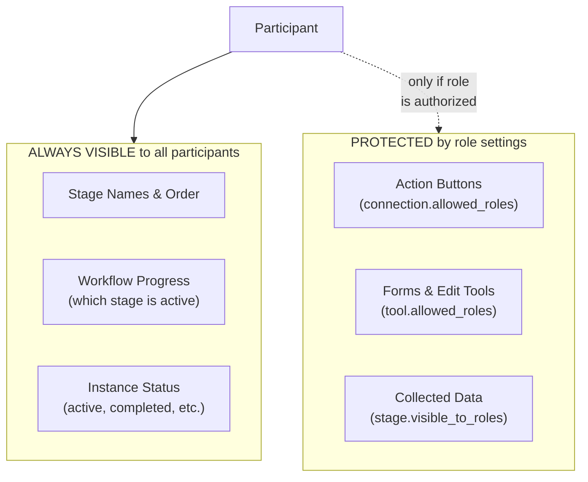

---

## For Business Users: Understanding Data Exposure

### What Your Participants Will Always See

| Information | Visibility | Example |
|-------------|------------|---------|
| Stage names | All participants | "Submit", "Review", "Approved" |
| Number of stages | All participants | "Stage 2 of 4" |
| Current stage | All participants | "Currently at: Review" |
| Instance status | All participants | "Active", "Completed" |

### What You Control With Roles

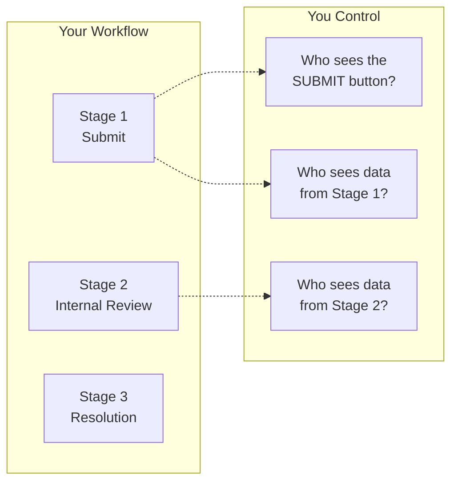

### Role Configuration Cheat Sheet

| Setting | Empty = | Specific Roles = |
|---------|---------|------------------|
| `stage.visible_to_roles` | All roles see data from this stage | Only listed roles see data |
| `connection.allowed_roles` | All roles see this action button | Only listed roles see button |
| `tool.allowed_roles` | All roles see this form/tool | Only listed roles see it |
| `workflow.entry_allowed_roles` | Anyone can create new instances | Only listed roles can create |

### Example: Insurance Claim Workflow

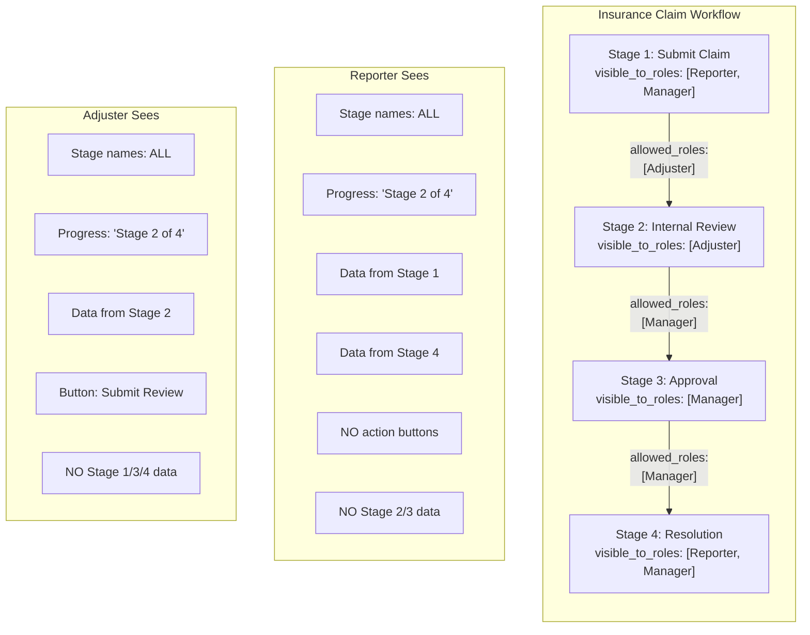

### Data Exposure Summary

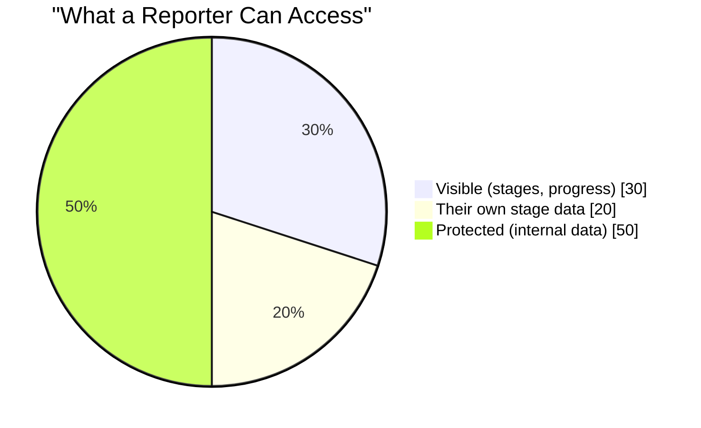

**Key Principle:** Participants see workflow STRUCTURE (stages, progress) but NOT implementation DETAILS (internal forms, data from protected stages).

---

## For Developers: Technical Implementation

### Architecture Overview

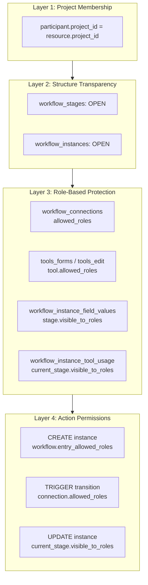

### PocketBase Rule Patterns

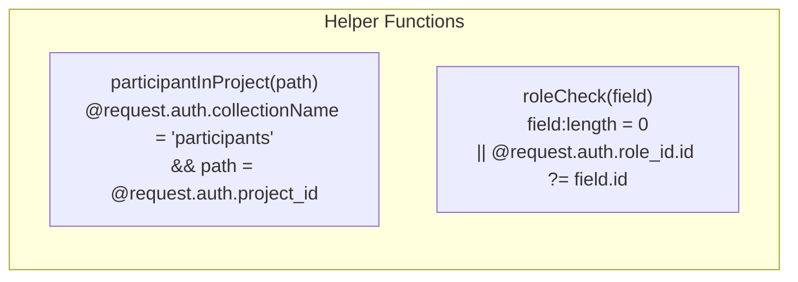

### Collection Access Rules

```mermaid
erDiagram
    workflow_stages {
        string listRule "OPEN - all project participants"
        string viewRule "OPEN - all project participants"
    }

    workflow_connections {
        string listRule "roleCheck(allowed_roles)"
        string viewRule "roleCheck(allowed_roles)"
    }

    workflow_instances {
        string listRule "OPEN - all project participants"
        string viewRule "OPEN - all project participants"
        string createRule "roleCheck(workflow.entry_allowed_roles)"
        string updateRule "roleCheck(current_stage.visible_to_roles)"
    }

    tools_forms {
        string listRule "stage: roleCheck(allowed_roles)"
        string listRule2 "connection: roleCheck(connection.allowed_roles)"
    }

    workflow_instance_field_values {
        string listRule "roleCheck(stage_id.visible_to_roles)"
        string createRule "roleCheck(current_stage.visible_to_roles)"
        string updateRule "roleCheck(stage_id.visible_to_roles)"
    }
```

### Data Flow: What Gets Filtered

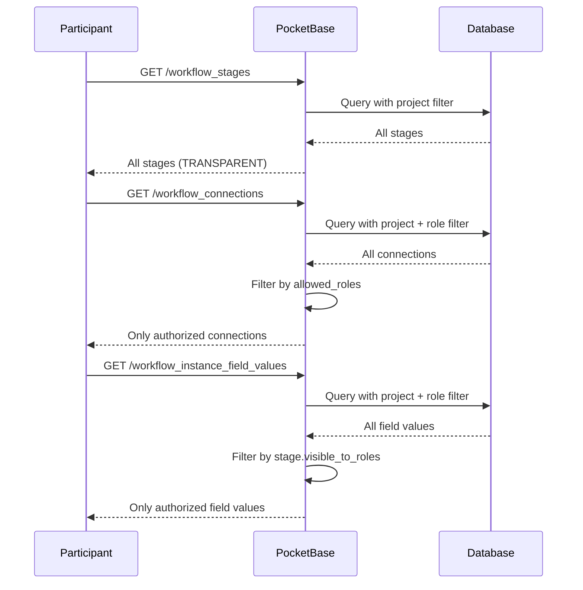

### Empty Array Convention

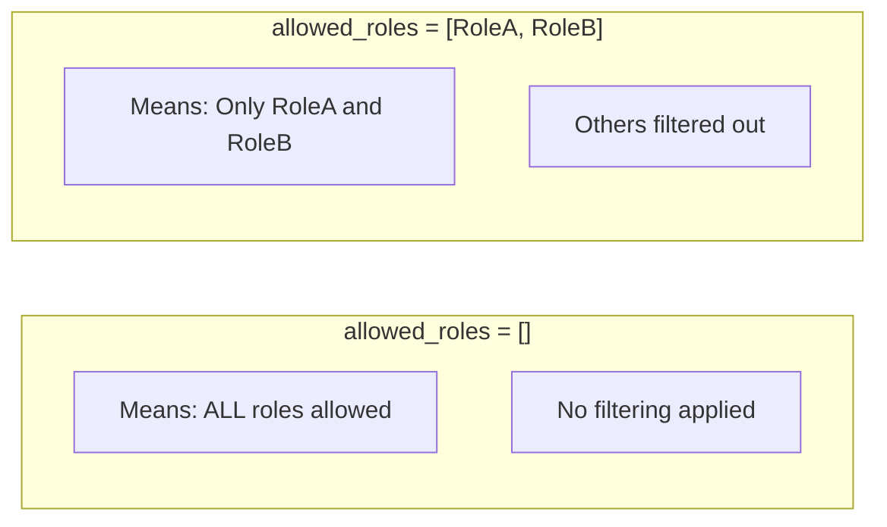

### Rule Implementation Reference

| Collection | LIST/VIEW Rule |
|------------|----------------|
| `workflow_stages` | `owner OR participantInProject` |
| `workflow_connections` | `owner OR (participantInProject AND roleCheck(allowed_roles))` |
| `workflow_instances` | `owner OR participantInProject` |
| `tools_forms` | `owner OR (participantInProject AND (connection: roleCheck(connection.allowed_roles) OR stage: roleCheck(allowed_roles)))` |
| `tools_form_fields` | Inherits from parent form |
| `tools_edit` | `owner OR (participantInProject AND (connection: roleCheck(connection.allowed_roles) OR stage: roleCheck(allowed_roles)))` |
| `workflow_instance_field_values` | LIST/VIEW: `roleCheck(stage_id.visible_to_roles)`; CREATE: `roleCheck(current_stage.visible_to_roles)` |
| `workflow_instance_tool_usage` | `owner OR (participantInProject AND roleCheck(instance.current_stage.visible_to_roles))` |

### Important: CREATE vs READ for Field Values

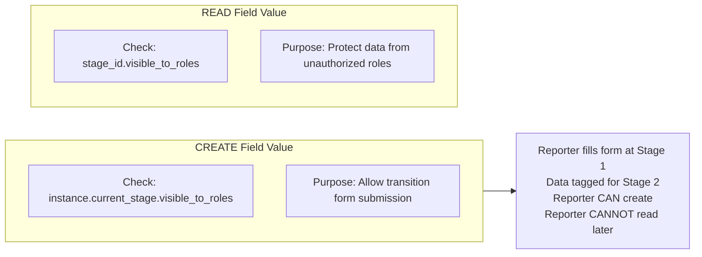

### Important: No Creator Bypass

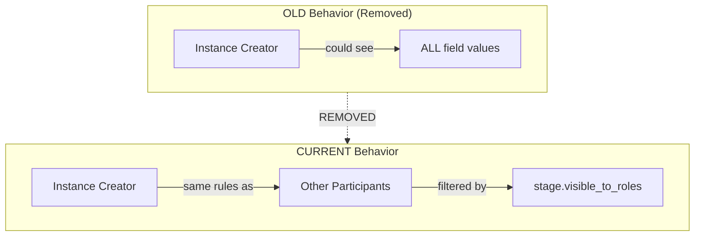

**Why:** The creator of an instance should not automatically see sensitive data from internal processing stages. All participants are treated equally based on their role.

---

## Migration Files

| File | Purpose |
|------|---------|
| `1768800000_add_workflow_entry_roles.js` | Adds `entry_allowed_roles` field to workflows |
| `1768800001_workflow_access_rules.js` | Implements the 4-layer access control model |

---

## Testing Access Control

### As Admin (Project Owner)
- Should see ALL data in all collections
- Full CRUD on everything

### As Participant
Test with different roles:

```bash
# Get participant token
curl -X POST "$PB_URL/api/collections/participants/auth-with-password" \
  -d '{"identity":"test@example.com","password":"test123"}'

# Test connections (should only see allowed ones)
curl -H "Authorization: Bearer $TOKEN" \
  "$PB_URL/api/collections/workflow_connections/records"

# Test field values (should only see authorized stages)
curl -H "Authorization: Bearer $TOKEN" \
  "$PB_URL/api/collections/workflow_instance_field_values/records"
```

---

## Quick Decision Guide

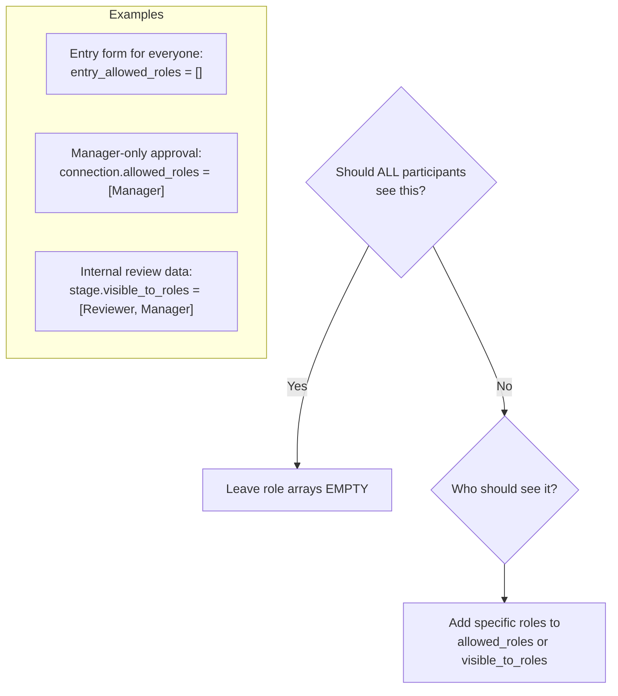
