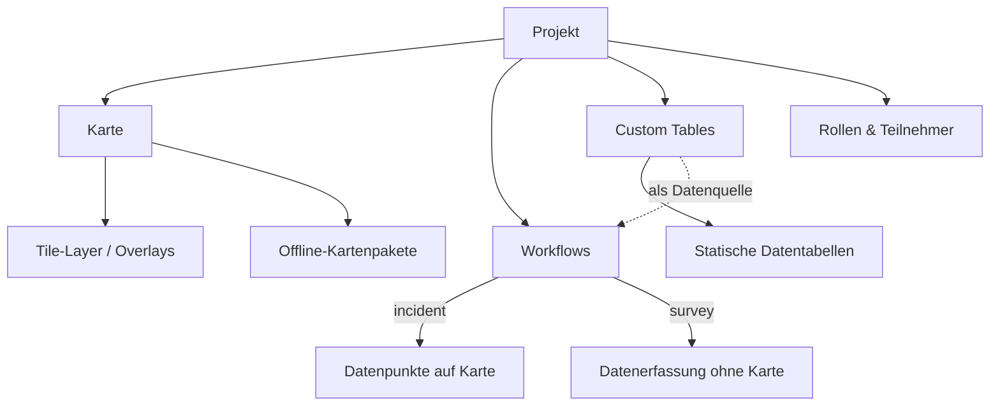
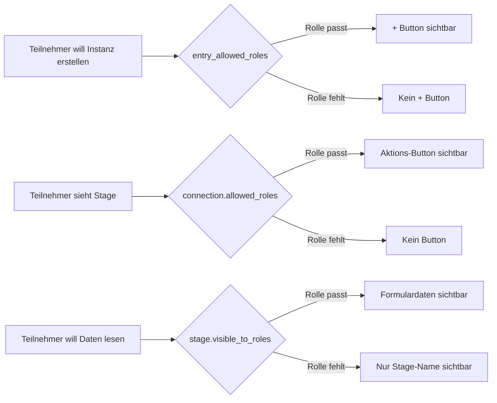

# Workflow Builder Anleitung

Referenz fuer die Einrichtung von Workflows in Ueberblick Sector. Konzepte, Einstellungen und Berechtigungsmodell.

---

## Inhaltsverzeichnis

1. [Ueberblick: Was ist Ueberblick?](#ueberblick-was-ist-ueberblick)
2. [Navigation](#navigation)
3. [Grundkonzepte](#grundkonzepte)
4. [Berechtigungsmodell](#berechtigungsmodell)
5. [Einstellungen-Referenz](#einstellungen-referenz)
6. [Walkthrough: Beispiel-Workflow](#walkthrough-beispiel-workflow)
7. [Haeufige Szenarien und Tipps](#haeufige-szenarien-und-tipps)

---

## Ueberblick: Was ist Ueberblick?

Ueberblick Sector ist die Admin-Oberflaeche, in der eine kartenbasierte Mobile-App zusammengestellt wird. Die fertige App nutzen Teilnehmer auf dem Handy -- auch offline.



Ein **Projekt** buendelt alle Bausteine der App:

- **Karte** -- Tile-Layer und Overlays konfigurieren. Fuer Offline-Einsatz koennen Kartenpakete erstellt werden.
- **Workflows** -- Prozesse modellieren (z.B. "Vorfall melden", "Inspektion durchfuehren"). Bei `incident`-Workflows erscheinen Datenpunkte als Marker auf der Karte, bei `survey`-Workflows geht es rein um Datenerfassung.
- **Custom Tables** -- Statische Datentabellen (z.B. Handwerker, Materiallisten). Spalten koennen als Auswahlquelle in Workflow-Formularen dienen (ueber den `custom_table_selector`-Feldtyp).
- **Rollen & Teilnehmer** -- Steuern, wer was sehen und tun darf.

Dieses Dokument konzentriert sich auf den **Workflow Builder** -- das zentrale Werkzeug zur Prozessmodellierung.

---

## Navigation

### Builder oeffnen

```
Projekt-Sidebar > Workflows > [Workflow] > Build
```

### Builder-Layout

```
+------------------+------------------------+--------------------+
|                  |                        |                    |
|  Linke Sidebar   |     Canvas             |   Rechte Sidebar   |
|  (Kontext)       |     (Visueller Editor) |   (Eigenschaften/  |
|                  |                        |    Editoren)        |
|  Tools fuer das  |  Stages platzieren,    |   Kontextabhaengig |
|  ausgewaehlte    |  Connections ziehen,   |   je nach Auswahl  |
|  Element         |  Elemente auswaehlen   |                    |
|                  |                        |                    |
+------------------+------------------------+--------------------+
```

### Schnellreferenz

| Aktion | Ort |
|---|---|
| **Rollen** verwalten | Projekt-Sidebar > Rollen |
| **Workflow** anlegen | Projekt-Sidebar > Workflows > Neu |
| **Workflow-Einstellungen** | Workflows > Workflow anklicken |
| **Builder** oeffnen | Workflows > Workflow > Build |
| **Stage** hinzufuegen | Aus linker Sidebar auf Canvas ziehen |
| **Stage-Berechtigungen** (`visible_to_roles`) | Stage anklicken > Eigenschaften > Berechtigungen-Tab |
| **Entry Connection** konfigurieren | Start-Stage anklicken > Stage Preview oder Eigenschaften |
| **Connection** erstellen | Handle einer Stage zur Ziel-Stage ziehen |
| **Connection-Berechtigungen** (`allowed_roles`) | Connection-Pfeil anklicken > Berechtigungen-Tab |
| **Button-Darstellung** (Label, Farbe, Bestaetigung) | Connection-Pfeil > Einstellungen-Tab |
| **Formular** an Connection | Connection anklicken > Formular-Tool hinzufuegen |
| **Formularfelder** bearbeiten | Formular-Tool anklicken > Formular-Editor |
| **Formularfeld** hinzufuegen | Formular-Editor > Feldtyp aus Palette ziehen |
| **Feld** konfigurieren | Formular-Editor > Feld anklicken > rechtes Panel |
| **Edit Tool** hinzufuegen | Stage anklicken > Edit Tool hinzufuegen |
| **Edit-Tool-Felder** konfigurieren | Edit-Tool-Editor > Felder aus Vorgaenger-Formularen waehlen |
| **Automatisierung** einrichten | Rechte Sidebar > Automatisierungs-Ansicht |
| **Kartenebenen** | Projekt-Sidebar > Karten-Einstellungen |

---

## Grundkonzepte

### Projekt

Der uebergeordnete Container. Workflows, Rollen, Teilnehmer und Kartenebenen gehoeren jeweils zu einem Projekt. Projektzugehoerigkeit ist Voraussetzung fuer jeglichen Zugriff durch Teilnehmer.

### Workflow

Eine Prozessdefinition mit Name, Typ (`incident` oder `survey`) und Aktivierungsstatus. Nur aktive Workflows sind fuer Teilnehmer sichtbar.

### Stage

Stages bilden den Lebenszyklus einer Instanz ab. Eine Instanz befindet sich immer in genau einer Stage. Stages definieren, **in welchem Zustand** sich ein Datenpunkt gerade befindet (z.B. "Eingereicht", "In Pruefung", "Abgeschlossen") und **wer die dort erfassten Daten einsehen darf** (ueber `visible_to_roles`, siehe [Berechtigungsmodell](#berechtigungsmodell)).

### Connection

Connections werden im Builder als **Pfeile** zwischen Stages dargestellt. Fuer Teilnehmer erscheinen sie als **Buttons**. Jede Connection definiert einen moeglichen Uebergang von Stage A zu Stage B: wer ihn ausloesen darf (`allowed_roles`), wie der Button aussieht (Label, Farbe), und welche Tools dabei abgearbeitet werden.

**Entry Connection** -- wird automatisch mit der Start-Stage angelegt und traegt das initiale Formular zur Instanzerstellung. Jeder Workflow braucht ein initiales Formular, da eine Instanz ohne Daten nicht existieren kann.

### Tools

Tools sind die funktionalen Bausteine eines Workflows. Entscheidend ist, **wo** ein Tool angehaengt wird:

| Anbindung | Verhalten |
|---|---|
| **Connection** | Tool wird ausgefuehrt, wenn der Teilnehmer den Connection-Button klickt. Alle Tools an einer Connection muessen abgeschlossen werden, bevor die Instanz zur naechsten Stage wechselt. |
| **Stage** | Tool erscheint als eigener Button auf dieser Stage. Kann jederzeit ausgefuehrt werden, solange die Instanz in dieser Stage ist. |
| **Global** | Tool erscheint als Button auf **jeder** Stage im Workflow. |

Die verfuegbaren Tool-Typen:

**Form** -- Datenerfassung ueber strukturierte Formulare mit Seiten und Feldern (Text, Zahl, Datum, Datei, Dropdown etc.). Aktuell nur an Connections anbindbar.

**Edit Tool** -- Nachtraegliche Bearbeitung bereits erfasster Feldwerte oder des Kartenstandorts. Anbindbar an Connection, Stage oder Global.

**Automation** -- Regelbasierte Aktionen, die automatisch bei Stufenwechsel (`on_transition`), Feldaenderung (`on_field_change`) oder zeitgesteuert (`scheduled`) ausgefuehrt werden. Automatisierungen pruefen Bedingungen und fuehren Aktionen aus: Feldwerte setzen, Instanz-Status aendern, Stage wechseln. Arbeiten auf Workflow-Ebene (global).

### Workflow-Instanz

Ein konkreter Datenpunkt innerhalb eines Workflows. Jede Instanz hat eine aktuelle Stage, einen Status (active, completed, archived), einen Kartenstandort (bei Incidents) und die gesammelten Feldwerte. Instanzen erscheinen als **Marker auf der Karte**.

### Das Datenmodell

Gedanklich laesst sich ein Workflow mit einer Tabelle vergleichen: Jede Workflow-Instanz ist eine **Zeile**, jedes Formularfeld eine **Spalte**. Formulare rendern eine strukturierte UI, die falsche Dateneingaben unwahrscheinlicher macht als freie Zelleingabe.

Alle Tools (Forms, Edit Tools) sind letztlich Wege, die Spalten einer Zeile zu befuellen oder zu bearbeiten. Connections definieren, wann welche Tools ausgefuehrt werden und wann eine Instanz in die naechste Stage wechselt.

**Beispiel -- Workflow "Schaden melden":** Drei Stages -- "Gemeldet" (Formular: Meldedatum, Schwere), "In Bearbeitung" (Formular: Verantwortlicher, Prioritaet), "Abgeschlossen" (Formular: Abschluss-Datum, Massnahme). Zwei Rollen -- Gast und Hausmeister. Stage "In Bearbeitung" hat `visible_to_roles = [Hausmeister]` (siehe [Berechtigungsmodell](#berechtigungsmodell)).

**Alle Attribute** (Hausmeister sieht alle Stages):

| Aktuelle Stage | Meldedatum | Schwere | Verantwortlicher | Prioritaet | Abschluss-Datum | Massnahme |
|---|---|---|---|---|---|---|
| Abgeschlossen | 2026-03-01 | Hoch | Mueller | Dringend | 2026-03-05 | Rohr ersetzt |

**Gast-Sicht** (kein Zugriff auf Stage "In Bearbeitung"):

| Aktuelle Stage | Meldedatum | Schwere | Abschluss-Datum | Massnahme |
|---|---|---|---|---|
| Abgeschlossen | 2026-03-01 | Hoch | 2026-03-05 | Rohr ersetzt |

Dieselbe Instanz, weniger Spalten. Die aktuelle Stage ist immer sichtbar -- der Gast weiss, wo der Prozess steht, aber nicht was intern passiert.

---

## Berechtigungsmodell

### Die goldene Regel

> **Leere Rollenliste = ALLE Teilnehmer haben Zugriff.**
> **Bestimmte Rollen = NUR diese Teilnehmer.**

Gilt fuer jede Rolleneinstellung im System. Dieses Verhalten wird moeglicherweise in einem zukuenftigen Update invertiert, aktuell bedeutet leer aber offen.

**Hinweis:** Um etwas komplett zu sperren, kann eine Dummy-Rolle (z.B. "none") angelegt werden, der kein Teilnehmer zugewiesen ist.

### Rolle

Rollen (z.B. "Melder", "Inspektor", "Manager") steuern drei Dinge:



Ein Teilnehmer kann **mehrere Rollen** haben. Bei der Berechtigungspruefung genuegt es, wenn eine der zugewiesenen Rollen in der jeweiligen Rollenliste enthalten ist.

### Rollengesteuerte Einstellungen

| Einstellung | Steuert | Ort |
|---|---|---|
| `workflow.entry_allowed_roles` | Wer **neue Instanzen erstellen** darf ("+"-Button) | Builder: Entry Connection > Berechtigungen, oder Workflow-Einstellungen |
| `connection.allowed_roles` | Wer den **Aktions-Button** sieht und den Uebergang ausloesen kann | Builder: Connection anklicken > Berechtigungen-Tab |
| `stage.visible_to_roles` | Wer die **bei dieser Stage erfassten Daten** einsehen kann | Builder: Stage anklicken > Eigenschaften > Berechtigungen-Tab |
| `form.allowed_roles` | Wer ein **Stage-Formular** sehen/ausfuellen kann (Connection-Formulare erben von der Connection) | Builder: Stage-Formular-Einstellungen |
| `edit_tool.allowed_roles` | Wer ein **Edit Tool** nutzen kann | Builder: Edit-Tool-Einstellungen |

### Strukturelle Transparenz

Folgende Informationen sind fuer alle Projektteilnehmer immer sichtbar:

| Information | Beispiel |
|---|---|
| Alle Stage-Namen | "Eingereicht", "Pruefung", "Genehmigt" |
| Workflow-Fortschritt | "Aktuell bei Stage 2 von 4" |
| Aktuelle Stage einer Instanz | "Aktuell bei: Pruefung" |
| Instanz-Status | "Active", "Completed" |

### Was `visible_to_roles` tatsaechlich steuert

> **`visible_to_roles` verbirgt NICHT die Stage selbst.**

Stage-Namen und Fortschritt sind immer sichtbar (strukturelle Transparenz). `visible_to_roles` steuert den Zugriff auf die **Formulardaten, die beim Uebergang in diese Stage erfasst wurden**.

Formulare haengen an Connections. Wenn ein Teilnehmer ein Formular auf einer Connection ausfuellt, die zu Stage X fuehrt, werden die Daten Stage X zugeordnet. `visible_to_roles` auf Stage X bestimmt, wer diese Daten lesen kann.

**Beispiel:** Drei Stages: Eingereicht, Interne Pruefung, Loesung.

- "Interne Pruefung" hat `visible_to_roles = [Inspektor, Manager]`.
- Ein Melder sieht in der Zeitleiste, dass die Instanz bei "Interne Pruefung" steht.
- Die Daten, die der Inspektor beim Uebergang in "Interne Pruefung" erfasst hat, sind fuer den Melder **nicht einsehbar**.
- Erreicht die Instanz "Loesung" (Melder in `visible_to_roles`), sieht der Melder die Loesungsdaten -- aber weiterhin nicht die Daten der internen Pruefung.

### Datenschutz-Mechanik

Feldwerte werden mit der Stage getaggt, bei der sie erfasst wurden. Bei Datenabruf prueft das System `visible_to_roles` der zugehoerigen Stage:

- Daten bleiben geschuetzt, auch wenn die Instanz laengst in einer spaeteren Stage ist.
- Ein Melder, der bei Stage 1 Daten eingereicht hat, sieht nicht automatisch Daten von Stage 2.
- **Kein Ersteller-Privileg** -- der Ersteller einer Instanz unterliegt denselben Regeln wie alle anderen Teilnehmer.

### Berechtigungsvererbung

Formulare und Edit Tools koennen an **Connections** oder **Stages** angehaengt werden. Das bestimmt die Berechtigungslogik:

| Angehaengt an | `allowed_roles`-Verhalten |
|---|---|
| **Connection** | Formular/Tool erbt die `allowed_roles` der Connection. Keine separate Einstellung. |
| **Stage** | Formular/Tool hat ein eigenes `allowed_roles`-Feld, unabhaengig von `visible_to_roles` der Stage. |

Die `allowed_roles` einer Connection ist das Tor: Wer den Button sieht, bearbeitet alle daran angehaengten Tools. Beim Klick muessen **alle** angehaengten Tools abgeschlossen werden, bevor die Instanz weiterwandert.

`visible_to_roles` einer Stage ist davon voellig unabhaengig -- sie steuert, wer die erfassten Daten *lesen* kann, nicht wer das Formular *ausfuellen* kann.

---

## Einstellungen-Referenz

### Workflow-Einstellungen

| Einstellung | Beschreibung |
|---|---|
| **Name** | Anzeigename in der App und Admin-Oberflaeche. |
| **Typ** | `incident` oder `survey`. Incidents werden auf der Karte platziert; Surveys benoetigen keinen Standort. |
| **Aktiv** | Nur aktive Workflows sind fuer Teilnehmer sichtbar. |
| **Entry Allowed Roles** | Welche Rollen neue Instanzen erstellen duerfen. Wird beim Speichern von der `allowed_roles` der Entry Connection synchronisiert. |
| **Marker-Farbe** | Farbe des Kartenmarkers fuer Instanzen dieses Workflows. |
| **Icon-Konfiguration** | Symbol auf dem Kartenmarker und in der Workflow-Liste. |

### Stage-Einstellungen

| Einstellung | Beschreibung |
|---|---|
| **Name** | Anzeigename in Zeitleiste und Canvas. |
| **Typ** | `start`, `intermediate` oder `end`. |
| **Reihenfolge** | Anzeigereihenfolge in Listen und Zeitleisten. |
| **Visible to Roles** | Siehe [Was `visible_to_roles` tatsaechlich steuert](#was-visible_to_roles-tatsaechlich-steuert). |
| **Position (x, y)** | Canvas-Koordinaten. Wird per Drag gesetzt. |

### Connection-Einstellungen

| Einstellung | Beschreibung |
|---|---|
| **Action Name** | Interner Bezeichner. |
| **Allowed Roles** | Welche Rollen den Aktions-Button sehen und den Uebergang ausloesen koennen. |
| **Button Label** | Text auf dem Aktions-Button (z.B. "Absenden", "Genehmigen"). |
| **Button Color** | Hex-Farbwert des Buttons. |
| **Requires Confirmation** | Bestaetigungsdialog vor Ausfuehrung. |
| **Confirmation Message** | Text im Bestaetigungsdialog. |

### Formular-Einstellungen

| Einstellung | Beschreibung |
|---|---|
| **Name** | Anzeigename des Formulars. |
| **Allowed Roles** | Nur bei Stage-Formularen. Siehe [Berechtigungsvererbung](#berechtigungsvererbung). |
| **Seiten** | Mehrseitige Formulare moeglich. Jede Seite hat Titel und Felder. |

### Formularfeld-Einstellungen

| Einstellung | Beschreibung |
|---|---|
| **Label** | Feldbeschriftung fuer Teilnehmer. |
| **Typ** | `short_text`, `long_text`, `number`, `email`, `date`, `file`, `dropdown`, `multiple_choice`, `smart_dropdown`, `custom_table_selector`. |
| **Pflichtfeld** | Feld muss vor Absenden ausgefuellt sein. |
| **Placeholder** | Hinweistext im leeren Feld. |
| **Hilfetext** | Zusaetzliche Erlaeuterung unterhalb des Feldes. |
| **Validierungsregeln** | Typabhaengig: Min/Max-Laenge (Text), Min/Max-Wert (Zahl), Regex (Text), Min/Max-Auswahl (Mehrfachauswahl), erlaubte Dateitypen (Datei), Datum-Modus (Datum/Datum+Zeit/Zeit). |
| **Feldoptionen** | Fuer Dropdowns und Mehrfachauswahl: waehlbare Optionen (Label + optionale Beschreibung). |
| **Smart Dropdown Konfig** | Bedingte Optionen basierend auf einem anderen Feldwert. |
| **Custom Table Selector Konfig** | Auswahl aus bestehenden Projektdaten (Tabellen, Marker-Kategorien, Teilnehmer, Rollen). |
| **Seite** | Zuordnung zur Formularseite. |
| **Zeilenindex / Spaltenposition** | Layout: links, rechts oder volle Breite innerhalb einer Zeile. |

### Edit-Tool-Einstellungen

| Einstellung | Beschreibung |
|---|---|
| **Edit Mode** | `form_fields` (Feldwerte bearbeiten) oder `location` (Kartenposition bearbeiten). |
| **Editable Fields** | (form_fields-Modus) Welche Felder aus frueheren Formularen editierbar sind. |
| **Is Global** | Wenn aktiv, erscheint der Button auf jeder Stage. |
| **Allowed Roles** | Wer das Edit Tool nutzen kann. |
| **Button Label / Color** | Darstellung des Buttons in der App. |

### Automatisierungs-Einstellungen

| Einstellung | Beschreibung |
|---|---|
| **Name** | Anzeigename. |
| **Trigger Type** | `on_transition`, `on_field_change` oder `scheduled`. |
| **Trigger Config** | Abhaengig vom Typ: Stages (Uebergang), Feld (Feldaenderung), Cron-Ausdruck + Inaktivitaetstage-Filter (zeitgesteuert). |
| **Steps** | Geordnete Liste von Schritten. Jeder Schritt hat Bedingungen (AND/OR) und Aktionen. |
| **Enabled** | Ein-/Ausschalten der Automatisierung. |

**Bedingungen:** Feldwerte pruefen (equals, contains, gt, lt, is_empty etc.), Instanz-Status, aktuelle Stage.

**Aktionen:** `set_field_value` (unterstuetzt Ausdruecke wie `{menge} * 10`), `set_instance_status`, `set_stage`.

---

## Walkthrough: Beispiel-Workflow

Aufbau eines "Vorfall melden"-Workflows mit drei Rollen: Melder, Inspektor, Manager.

### 1. Rollen anlegen

**Projekt-Sidebar > Rollen:**
- **Melder** -- reicht Vorfaelle ein
- **Inspektor** -- prueft und untersucht
- **Manager** -- genehmigt oder lehnt ab

### 2. Workflow anlegen

**Projekt-Sidebar > Workflows > Neu:**
- Name: "Vorfall melden"
- Typ: Incident
- Marker-Farbe waehlen

### 3. Builder oeffnen

**Build**-Button beim neuen Workflow.

### 4. Stages anlegen

Aus der linken Sidebar auf den Canvas ziehen:
1. **Start**-Stage -- umbenennen zu "Eingereicht"
2. **Intermediate**-Stage -- "In Pruefung"
3. Zwei **End**-Stages -- "Geloest" und "Abgelehnt"

### 5. Connections erstellen

Handles zwischen Stages ziehen:
- **Eingereicht** --> **In Pruefung**
- **In Pruefung** --> **Geloest**
- **In Pruefung** --> **Abgelehnt**

Jede Connection anklicken und **Button Label** im Einstellungen-Tab setzen (z.B. "Inspektor zuweisen", "Geloest", "Ablehnen").

### 6. Entry-Berechtigungen

Start-Stage anklicken > Stage Preview > Entry-Aktion konfigurieren:
- `allowed_roles = [Melder]`

### 7. Entry-Formular

Formular an die Entry Connection anhaengen:
- "Titel" (short_text, Pflichtfeld)
- "Beschreibung" (long_text, Pflichtfeld)
- "Foto" (file, optional)
- "Schweregrad" (dropdown: Niedrig, Mittel, Hoch)

### 8. Connection-Berechtigungen

`allowed_roles` je Connection setzen:
- **Eingereicht > In Pruefung**: `[Manager]`
- **In Pruefung > Geloest**: `[Inspektor]`
- **In Pruefung > Abgelehnt**: `[Inspektor]`

### 9. Datensichtbarkeit

`visible_to_roles` je Stage setzen:
- **Eingereicht**: leer
- **In Pruefung**: `[Inspektor, Manager]`
- **Geloest**: leer
- **Abgelehnt**: leer

### 10. Pruefungs-Formular

Connection **Eingereicht > In Pruefung** anklicken, Formular anhaengen:
- "Befunde" (long_text)
- "Empfohlene Massnahme" (dropdown)

### 11. Speichern und aktivieren

**Speichern** im Builder. Anschliessend auf der Workflows-Seite den Workflow auf **Aktiv** setzen.

### Ergebnis aus Teilnehmersicht

- **Melder**: "+"-Button auf Karte > "Vorfall melden" > Formular ausfuellen > Instanz bei "Eingereicht"
- **Manager**: Instanz sehen > "Inspektor zuweisen"-Button > Instanz wandert zu "In Pruefung"
- **Inspektor**: Instanz bei "In Pruefung" > Pruefungsformular + Buttons "Geloest" / "Ablehnen"
- **Melder**: sieht "In Pruefung" in der Zeitleiste, aber nicht die Pruefungsdaten (`visible_to_roles`)
- Nach Loesung: Melder sieht die Loesungsdaten

---

## Haeufige Szenarien und Tipps

### "Nur Manager duerfen genehmigen"

`allowed_roles = [Manager]` auf der Connection zur Genehmigungs-Stage. Nur Manager sehen den Button.

### "Interne Pruefungsdaten vor Meldern verbergen"

`visible_to_roles = [Inspektor, Manager]` auf der Pruefungs-Stage. Melder sehen den Stage-Namen, aber keine Formulardaten.

### "Alle duerfen melden, nur Inspektoren duerfen pruefen"

- Entry Connection: `allowed_roles = []` (alle koennen erstellen)
- Connection "Eingereicht" > "Pruefung": `allowed_roles = [Inspektor]`

### "Feld nach Einreichung bearbeitbar machen"

Edit Tool auf der gewuenschten Stage hinzufuegen:
1. Stage anklicken > Edit Tool hinzufuegen
2. Modus `form_fields` waehlen
3. Felder auswaehlen (aus frueheren Formularen)
4. `allowed_roles` setzen

### "Kartenstandort nachtraeglich aendern"

Edit Tool mit Modus `location` auf der entsprechenden Stage. Teilnehmer sehen einen "Standort bearbeiten"-Button.

### "Instanzen nach 7 Tagen Inaktivitaet abschliessen"

Scheduled Automation:
1. Trigger: `scheduled`, Cron fuer taegliche Ausfuehrung
2. `inactive_days`-Filter: 7
3. Aktion: `set_instance_status` auf "completed"

### "Summe aus Feldern berechnen"

`on_field_change`-Automation:
1. Trigger: Mengen-Feld ueberwachen
2. Aktion: `set_field_value` mit Ausdruck `{menge} * {preis}`

### "Stage-Wechsel basierend auf Feldwert"

`on_transition`-Automation:
1. Trigger: bei Ankunft in der Entscheidungs-Stage
2. Bedingung: Feld "Schweregrad" equals "Kritisch"
3. Aktion: `set_stage` zur "Eskaliert"-Stage

### Stolperfallen

**"Entry Connection im Builder nicht sichtbar"** -- Entry Connections werden automatisch mit der Start-Stage angelegt und sind im Canvas nicht als Pfeil dargestellt. Konfiguration ueber Start-Stage anklicken > Stage Preview oder Eigenschaften-Panel.

**"`visible_to_roles` geaendert -- wirkt sofort"** -- `visible_to_roles` wird bei jedem Datenabruf live geprueft. Aenderungen gelten sofort fuer alle bestehenden Daten. Keine Migration noetig.

**"Instanz-Ersteller sieht eigene Daten nicht"** -- Es gibt kein Ersteller-Privileg (siehe [Datenschutz-Mechanik](#datenschutz-mechanik)). Loesung: mindestens eine Rolle des Erstellers in `visible_to_roles` aufnehmen.

**"Edit Tool zeigt zukuenftige Felder"** -- Tut es nicht. Edit Tools zeigen ausschliesslich Felder aus Stages, die die Instanz bereits durchlaufen hat (aktuelle und fruehere Stages).

### Tipps

- **Iterativ vorgehen.** Zuerst mit leeren Rollen-Arrays arbeiten (alles offen), Workflow verifizieren, dann schrittweise Berechtigungen einschraenken.
- **Mit verschiedenen Rollen testen.** Test-Teilnehmer pro Rolle anlegen und den Workflow durchspielen.
- **Stage Preview nutzen.** Im Builder eine Stage anklicken und die Stage Preview pruefen -- zeigt die Teilnehmersicht mit verfuegbaren Buttons und Tools.
- **Regelmaessig speichern.** Der Builder haelt Aenderungen im Speicher. Beim Schliessen des Browsers gehen ungespeicherte Aenderungen verloren.
- **Self-Loops fuer Bearbeitungen.** Eine Connection von einer Stage zu sich selbst erstellen und ein Edit Tool anhaengen -- ermoeglicht Bearbeitungen ohne Stufenwechsel.
