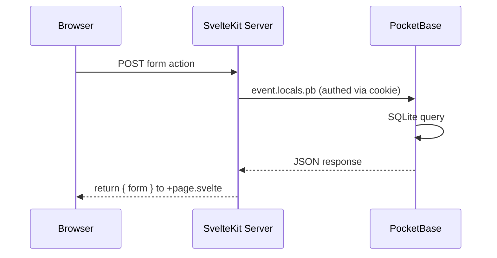
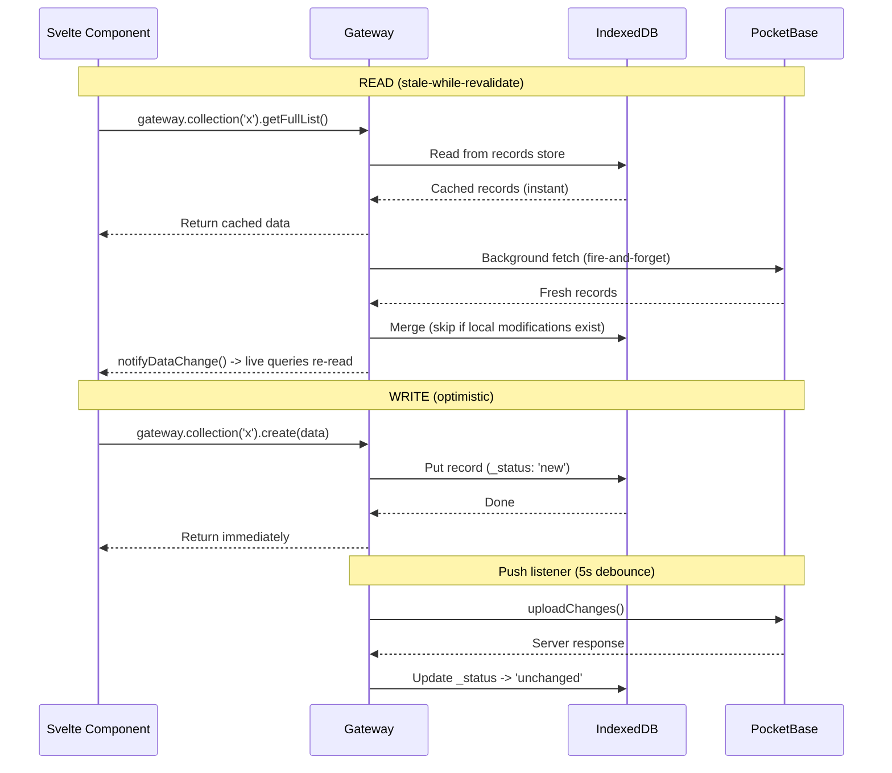
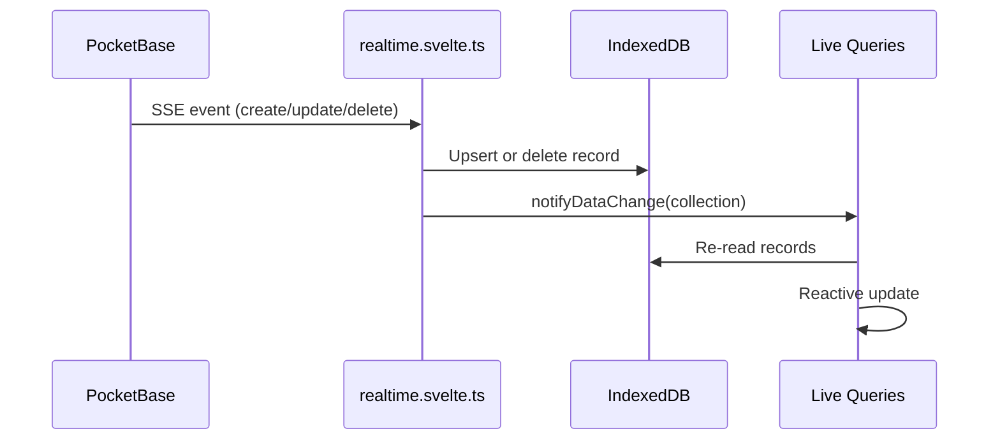
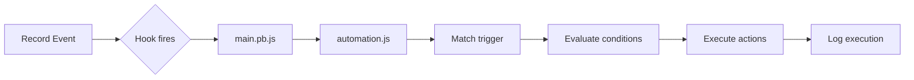
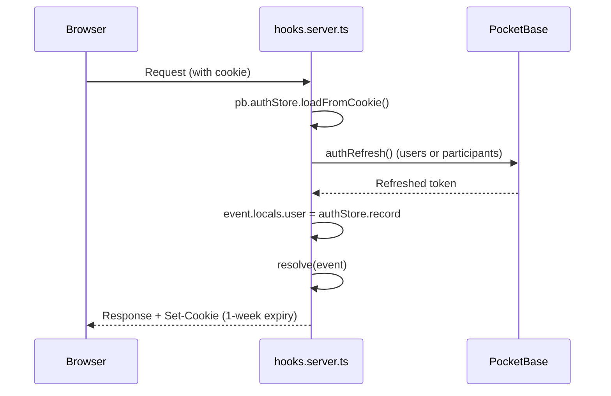
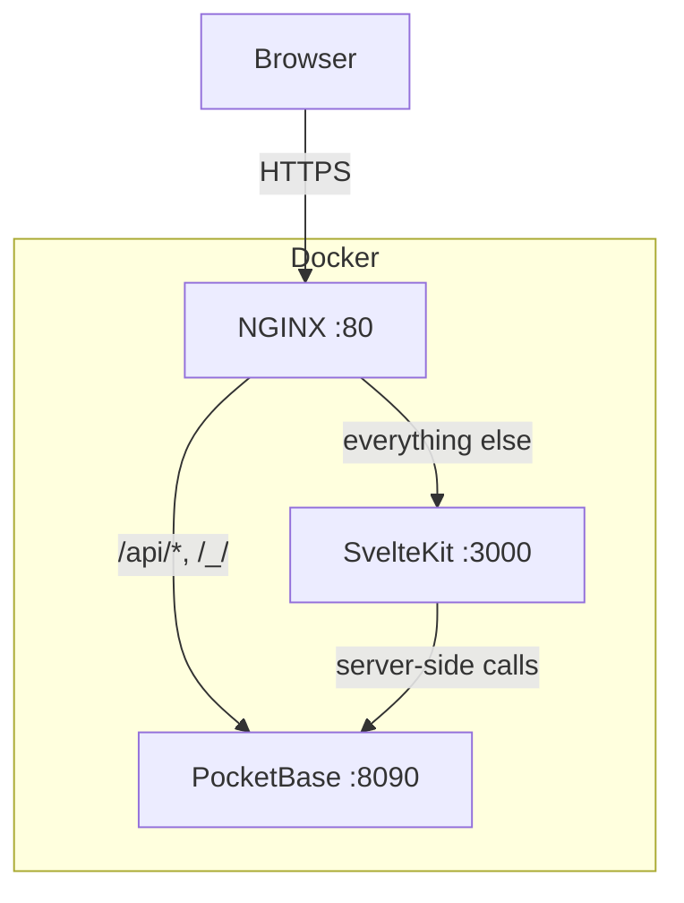

# Architecture

System overview of Ueberblick -- a geographic data collection platform with offline-first capabilities.

---

## System Diagram

```
                          +------------------+
                          |     NGINX        |
                          | (reverse proxy)  |
                          +--------+---------+
                                   |
                    +--------------+--------------+
                    |                             |
            +-------+-------+          +---------+----------+
            |   SvelteKit   |          |    PocketBase       |
            |  (port 3000)  |          |    (port 8090)      |
            |  adapter-node |          |  + SpatiaLite       |
            +-------+-------+          |  + JS hooks (goja)  |
                    |                  +---------+----------+
                    |                             |
         +----------+-----------+       +---------+---------+
         |       Browser        |       |    SQLite DB       |
         |  Svelte 5 SPA        |       |  pb/pb_data/       |
         |  IndexedDB (idb)     |       +-------------------+
         |  Service Worker (SW) |
         |  Leaflet map         |
         +----------------------+
```

In Docker, NGINX runs inside the `frontend` container and proxies `/api/*` and `/_/` to the `backend` container. In local dev, Vite's dev server proxies specific PocketBase routes (`/api/collections`, `/api/files`, `/api/realtime`, `/api/batch`, `/api/admins`, `/api/health`, `/_/`) to `localhost:8090`, while SvelteKit API routes (e.g. `/api/tiles`) are served by Vite directly.

---

## Directory Structure

```
punktstudio/
  pb/                              # PocketBase backend (Go)
    main.go                        # Go binary: SpatiaLite loader, server config
    pb_hooks/                      # Server-side JS hooks (goja VM)
      main.pb.js                   # Event hooks: auth setup, automation triggers, cron
      automation.js                # Automation engine: conditions, actions, expressions
    pb_migrations/                 # JS migration files (collection schema)
    pb_data/                       # SQLite database + file storage (gitignored)

  src/
    hooks.server.ts                # SvelteKit hooks: auth (cookie) + Paraglide i18n

    routes/
      (admin)/                     # Admin UI (Ueberblick Sector)
        +layout.svelte             # Sidebar navigation, project switcher
        +layout.server.ts          # Auth guard (users collection), load projects
        login/                     # Admin login page
        logout/                    # Cookie-clearing endpoint
        projects/                  # CRUD: projects, workflows, tables, roles, participants
          [projectId]/
            workflows/[workflowId]/
              builder/             # Visual workflow editor (Svelte Flow canvas)
            custom-tables/[tableId]/
            marker-categories/[categoryId]/
            map-settings/
            participants/
            roles/

      participant/                 # Participant app (Ueberblick)
        +layout.svelte             # Mobile layout, gateway init, SW registration
        +layout.server.ts          # Auth guard (participants collection), collection list
        login/                     # Participant login (email or QR code)
        logout/
        map/                       # Main map view
          +page.svelte             # Leaflet map, marker rendering, FAB menu
          components/              # MapCanvas, LayerSheet, FilterSheet, etc.
          modules/                 # Pluggable sidebar modules
            workflow-instance-detail/  # Instance inspector with tool execution
              tools/               # FormFillTool, EditFieldsTool, ViewFieldsTool, etc.

      api/                         # SvelteKit API routes (server-side)
        tiles/[tilesetId]/[z]/[x]/[y]/  # MBTiles tile serving
        map-layers/upload/         # GeoTIFF/MBTiles upload + processing
        map-layers/[id]/status/    # Upload progress polling

    lib/
      config/
        pocketbase.ts              # URL resolution (dev proxy / Docker / mobile)

      pocketbase.ts                # Client-side PocketBase singleton

      server/                      # Server-only utilities (not shipped to browser)
        admin-auth.ts              # Superuser auth for privileged operations
        auth.ts                    # Auth helpers
        crud-actions.ts            # Generic CRUD form actions
        pocketbase-helpers.ts      # Server-side PB utilities
        tile-processor.ts          # GeoTIFF -> MBTiles conversion
        tile-packager.ts           # Offline tile package builder
        workflow-database.ts       # Workflow save/load helpers

      participant-state/           # Local-first data layer (browser-only)
        gateway.svelte.ts          # PocketBase-compatible proxy (IndexedDB + background fetch)
        db.ts                      # IndexedDB schema (idb library), 7 stores
        sync.svelte.ts             # Push/pull sync engine, conflict detection
        realtime.svelte.ts         # PocketBase SSE subscriptions
        persistence.svelte.ts     # Auto-persist gateway state
        context.svelte.ts          # Svelte context provider/consumer
        query.ts                   # Client-side filter/sort engine for IndexedDB records
        file-cache.ts              # Offline file blob storage
        tile-cache.svelte.ts       # Map tile caching
        pack-downloader.svelte.ts  # Offline package downloader
        network.svelte.ts          # Online/offline detection
        operation-log.ts           # Audit trail
        types.ts                   # Shared types

      workflow-builder/            # Admin workflow editor state
        state.svelte.ts            # Reactive builder state (stages, connections, tools)
        save.ts                    # Serialize/deserialize to PocketBase
        tools/                     # Tool type registry, schemas, field types
        components/                # ToolPicker, ToolIcon, ToolBar

      components/
        ui/                        # shadcn-svelte base components (Tailwind CSS 4 + bits-ui)
        admin/                     # Admin-specific: base-table, CRUD dialogs, icon designers
        mobile/                    # Bottom sheet, FAB, bottom nav
        map/                       # Leaflet map, tile layer, marker detail, panels
        form-renderer/             # FormRenderer, MediaGallery (fill/edit/view modes)
        responsive-sidebar.svelte  # Desktop panel / mobile drawer

      schemas/                     # Zod validation schemas
      types/                       # TypeScript type definitions
      stores/                      # Global stores (theme, font-size)
      utils/                       # Geo utils, SVG validation, QR export, etc.
      paraglide/                   # Generated i18n runtime

  messages/
    en.json                        # English translations
    de.json                        # German translations

  e2e/                             # Playwright end-to-end tests
  static/                          # Static assets (icons, manifest)
  docker-compose.yaml              # Two services: backend + frontend
```

---

## Frontend / Backend Split

### Two Auth Domains

| Concern | Admin (Ueberblick Sector) | Participant (Ueberblick) |
|---------|---------------------------|--------------------------|
| Collection | `users` | `participants` |
| Route group | `/(admin)/` | `/participant/` |
| Layout | Sidebar + desktop-first | Mobile-first, fixed header |
| Data access | Server-rendered via `event.locals.pb` | Local-first via gateway (IndexedDB) |
| Auth guard | `+layout.server.ts` checks `users` collection | `+layout.server.ts` checks `participants` collection |
| Offline | Not supported | Full offline support (IndexedDB + SW + tile cache) |

### SvelteKit Server (Node.js)

- Runs with `adapter-node` (port 3000)
- Handles SSR, form actions, API routes (tile serving, uploads)
- Each request gets a per-request PocketBase instance via `hooks.server.ts`
- Admin pages use `event.locals.pb` for all data operations (server-side)
- Privileged operations (e.g. listing all collections for sync) use `getAdminPb()` which authenticates as superuser

### PocketBase (Go + SpatiaLite)

- Single Go binary (`pb/main.go`) with SpatiaLite extension for geospatial queries
- JS hooks (`pb/pb_hooks/`) loaded via goja VM at startup -- no recompilation needed
- Provides: REST API, auth, file storage, realtime SSE, admin UI (`/_/`)
- Migrations in `pb/pb_migrations/` define collection schemas

---

## Major Modules

| Module | Key Files | Responsibility |
|--------|-----------|----------------|
| **Admin Routes** | `src/routes/(admin)/` | Server-rendered CRUD pages for projects, workflows, map settings, participants, roles, marker categories, custom tables |
| **Participant Routes** | `src/routes/participant/` | Local-first SPA: map view, login, offline support |
| **Participant State** | `src/lib/participant-state/` | IndexedDB gateway, sync engine, realtime SSE, file cache, tile cache, pack downloader |
| **Workflow Builder** | `src/lib/workflow-builder/` | Canvas editor state, save/load, tool registry, field type definitions |
| **Form Renderer** | `src/lib/components/form-renderer/` | `FormRenderer.svelte`, `MediaGallery.svelte` -- 3 modes: `fill` / `edit` / `view` |
| **PocketBase Backend** | `pb/main.go`, `pb/pb_hooks/main.pb.js` | Go binary with SpatiaLite; JS hooks for auth rules, automation, batch config |
| **Automation Engine** | `pb/pb_hooks/automation.js` | Trigger evaluation, condition checking, action execution (loaded via `require`) |
| **Map System** | Admin: layer management pages; Participant: Leaflet map | Layer upload, tile serving, tile caching, offline packages |
| **SvelteKit API Routes** | `src/routes/api/` | `/api/tiles/[tilesetId]/[z]/[x]/[y]`, `/api/map-layers/upload`, `/api/map-layers/[id]/status` |
| **Server Utilities** | `src/lib/server/` | `tile-processor.ts`, `tile-packager.ts`, `crud-actions.ts`, `auth.ts`, `admin-auth.ts`, `pocketbase-helpers.ts`, `workflow-database.ts` |
| **UI Components** | `src/lib/components/ui/` | shadcn-svelte base components (Tailwind CSS 4 + bits-ui) |

---

## Data Flow

### Admin (server-rendered)



Admin pages use standard SvelteKit form actions. The `+page.server.ts` files handle `load` and `actions`, communicating with PocketBase via the per-request `event.locals.pb` instance that is authenticated through cookie-based sessions set up in `hooks.server.ts`.

### Participant (local-first)



The gateway (`gateway.svelte.ts`) is a transparent proxy with a PocketBase-compatible API. Components call `gateway.collection('name').getFullList()` exactly like `pb.collection('name').getFullList()`. The gateway reads from IndexedDB first (instant response), then revalidates from the server in the background.

### Realtime (SSE)



Realtime subscriptions are set up per collection. On reconnect (`PB_CONNECT` event), a catch-up sync runs to fill any gaps. On tab focus, another catch-up sync runs (with 30-second cooldown).

### Sync Engine

The sync engine (`sync.svelte.ts`) handles three scenarios:

| Scenario | Trigger | What happens |
|----------|---------|--------------|
| **Push** | Local write (5s debounce) | Upload `new`/`modified`/`deleted` records to PocketBase; conflict detection (server wins) |
| **Catch-up** | SSE reconnect or tab focus | Push pending, then incremental pull (delta sync by `updated` timestamp), then deletion detection |
| **Full resync** | Manual "Sync Now" button | Clear sync timestamps, push, full pull, deletion detection |

Conflict resolution strategy: **server wins**. When a conflict is detected (server's `updated` timestamp differs from `_serverUpdated` stored locally), the server version is accepted and the conflict is stored in the IndexedDB `conflicts` store for participant review.

### Automation (PocketBase hooks)



Three trigger types:

| Trigger | Hook | Fires when |
|---------|------|------------|
| `on_transition` | `onRecordAfterUpdateSuccess` on `workflow_instances` | `current_stage_id` changes |
| `on_field_change` | `onRecordAfterCreateSuccess` / `onRecordAfterUpdateSuccess` on `workflow_instance_field_values` | A field value is created or updated |
| `scheduled` | `cronAdd` (every minute) | Cron expression matches, filtered by stage and inactivity |

---

## IndexedDB Schema

The participant state lives in an IndexedDB database (`participant-state`, version 8) with these stores:

| Store | Key | Purpose |
|-------|-----|---------|
| `records` | `{collection}/{id}` | Generic record cache -- any PocketBase collection |
| `operation_log` | `id` | Audit trail of all write operations |
| `tiles` | `{layerId}/{z}/{x}/{y}` | Cached map tiles (Blob) |
| `packages` | `id` | Downloaded offline package metadata |
| `files` | `{collection}/{recordId}/{fieldName}/{fileName}` | Cached file blobs (photos, documents) |
| `sync_metadata` | `collection` | Last sync timestamp per collection (for delta sync) |
| `conflicts` | `id` | Server-wins conflicts pending participant review |

Records in the `records` store carry metadata fields:

| Field | Values | Meaning |
|-------|--------|---------|
| `_status` | `unchanged` | Synced with server |
| | `new` | Created locally, not yet pushed |
| | `modified` | Changed locally, not yet pushed |
| | `deleted` | Marked for deletion, not yet pushed |
| `_serverUpdated` | ISO timestamp | Server's `updated` value at last pull (for conflict detection) |
| `_collection` | string | Collection name (for indexing) |
| `_key` | `{collection}/{id}` | Compound primary key |

---

## Auth Flow



- `hooks.server.ts` runs two middleware in sequence: `handleAuth` then `handleParaglide`
- Auth refresh determines collection from the stored record's `collectionName` field
- On 401/403, auth is cleared; on network errors, existing auth is preserved (prevents logout on transient failures)
- Admin and participant login are separate pages with separate auth flows

---

## Deployment



| Service | Container | Port | Role |
|---------|-----------|------|------|
| `backend` | `pocketbase-backend` | 8090 | PocketBase + SpatiaLite + JS hooks |
| `frontend` | `sveltekit-frontend` | 80 (NGINX) / 3000 (Node) | NGINX reverse proxy + SvelteKit SSR |

Docker network: `ueberblick-network` (bridge, subnet `172.27.0.0/16`).

Environment variables (required): `POCKETBASE_ADMIN_EMAIL`, `POCKETBASE_ADMIN_PASSWORD`.

---

## Key Architectural Decisions

| Decision | Rationale |
|----------|-----------|
| IndexedDB as primary participant store | Enables offline-first with immediate reads; sync runs in background |
| PocketBase (not Postgres) | Single-binary backend, embedded SQLite, built-in auth, realtime SSE, file storage |
| SpatiaLite extension | Geospatial queries (point-in-polygon, distance) without separate geo service |
| JS hooks (goja), not Go plugins | Faster iteration; no recompilation needed; loaded from `pb_hooks/` at startup |
| NGINX in frontend container | Single exposed port in production; handles static files + proxies to backend |
| Vite proxy in dev (specific routes only) | Proxies PocketBase routes while keeping SvelteKit API routes on Vite's dev server |
| Manual SW registration | `virtual:pwa-register` generates relative `./sw.js` path which breaks on sub-paths; manual registration uses absolute `/sw.js` |
| Separate auth collections | `users` for admins, `participants` for field workers -- different auth flows and permissions |
| `adapter-node` | Required for server-side rendering + API routes in Docker/production |
| Local-first gateway (not offline toggle) | All reads come from IndexedDB by default; background revalidation keeps data fresh; works offline without explicit mode switch |
| Server-wins conflict resolution | Simplest safe default for field data collection; conflicts stored for review but server version is immediately accepted |
| Per-collection realtime subscriptions | Catch-up sync on reconnect fills SSE gaps; no polling loop needed |

---

## Entry Points

| What | File |
|------|------|
| SvelteKit hooks (auth + i18n) | `src/hooks.server.ts` |
| Admin layout | `src/routes/(admin)/+layout.svelte` |
| Participant layout | `src/routes/participant/+layout.svelte` |
| Participant map page | `src/routes/participant/map/+page.svelte` |
| PocketBase Go binary | `pb/main.go` |
| PocketBase JS hooks | `pb/pb_hooks/main.pb.js` |
| Automation engine | `pb/pb_hooks/automation.js` |
| IndexedDB schema | `src/lib/participant-state/db.ts` |
| Participant state gateway | `src/lib/participant-state/gateway.svelte.ts` |
| Workflow builder state | `src/lib/workflow-builder/state.svelte.ts` |
| PocketBase URL config | `src/lib/config/pocketbase.ts` |
| Vite config (proxy, PWA, tests) | `vite.config.ts` |
| Docker compose | `docker-compose.yaml` |
