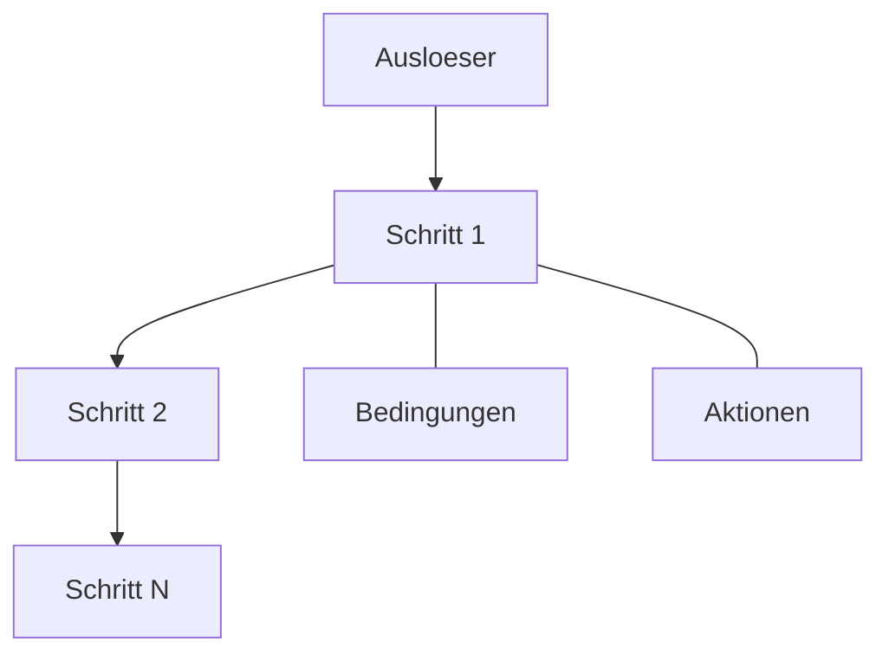

# Automatisierungen

Mit Automatisierungen lassen sich Aktionen definieren, die das System selbststaendig ausfuehrt -- ohne dass ein Teilnehmer etwas tun muss. Sie eignen sich ueberall dort, wo Vorgaenge nach festen Regeln ablaufen sollen: Werte automatisch berechnen, Eintraege nach einer bestimmten Zeit weiterschieben oder den Status aendern, sobald eine Bedingung eintritt.

## Was loest eine Automatisierung aus?

Jede Automatisierung braucht einen Ausloeser. Ueberblick bietet drei Moeglichkeiten:

**Bei Stufenwechsel:** Die Automatisierung startet, sobald ein Eintrag von einer Stufe in eine andere wechselt. So koennen Sie z.B. bei einer Sicherheitsbegehung automatisch einen Zeitstempel setzen, wenn ein Mangel in die Stufe "Behoben" uebergeht.

**Bei Feldaenderung:** Die Automatisierung reagiert, wenn sich ein bestimmter Feldwert aendert. Stellen Sie sich vor, bei einer Gebaeudezustandserfassung soll die Gesamtbewertung automatisch neu berechnet werden, sobald ein Einzelwert geaendert wird.

**Zeitgesteuert:** Die Automatisierung laeuft nach einem festen Zeitplan (mindestens alle 15 Minuten). Das ist besonders nuetzlich fuer Alterungsprozesse. In der Forstbefallsueberwachung koennen Sie z.B. Kaefersichtungen woechentlich automatisch herabstufen: Von "Aktuell" ueber "Letzte Woche" und "Vor 2 Wochen" bis "Historisch". Oder Sie setzen taeglich um 08:00 Uhr alle Reinigungsaufgaben zurueck auf "Offen".

Optional koennen Sie die Automatisierung auf eine bestimmte Stufe beschraenken -- dann werden nur Eintraege in dieser Stufe beruecksichtigt. Ausserdem koennen Sie angeben, wie viele Tage ein Eintrag inaktiv sein muss, bevor die Automatisierung greift. So lassen sich z.B. Eintraege archivieren, die seit 7 Tagen keine Aenderung mehr hatten.

## Aufbau einer Automatisierung

Eine Automatisierung besteht aus einem Ausloeser und einem oder mehreren Schritten, die der Reihe nach abgearbeitet werden. Jeder Schritt prueft zuerst seine Bedingungen und fuehrt dann -- falls alle erfuellt sind -- seine Aktionen aus.

Durch mehrere Schritte lassen sich auch verzweigte Ablaeufe abbilden. So koennten Sie in einem ersten Schritt pruefen, ob ein Brandschutz-Abschnitt als "Nicht konform" markiert ist und ihn automatisch eskalieren, waehrend ein zweiter Schritt alle Abschnitte in "Eingeschraenkt konform" nach 30 Tagen ohne Massnahme ebenfalls hochstuft.

## Bedingungen

Bedingungen bestimmen, ob ein Schritt ausgefuehrt wird. Sie vergleichen Feldwerte mit erwarteten Werten. Folgende Vergleiche stehen zur Verfuegung:

- **Ist gleich / ist nicht gleich** -- z.B. "Zustandsklasse ist D"
- **Enthaelt** -- z.B. "Bemerkung enthaelt das Wort 'dringend'"
- **Groesser / kleiner (auch gleich)** -- z.B. "Bewertung groesser als 3"
- **Ist leer / ist nicht leer** -- z.B. "Foto wurde noch nicht hochgeladen"

Sie koennen auch Felder miteinander vergleichen, den aktuellen Status eines Eintrags pruefen oder die aktuelle Stufe als Bedingung heranziehen. Mehrere Bedingungen lassen sich mit UND oder ODER verknuepfen.

## Aktionen

Wenn die Bedingungen erfuellt sind, fuehrt der Schritt seine Aktionen aus. Drei Aktionstypen stehen bereit:

**Feldwert setzen:** Setzt ein Feld auf einen bestimmten Wert. Dabei koennen Sie auch Berechnungen verwenden -- zum Beispiel den Durchschnitt aus zwei Bewertungsfeldern bilden. Ausdruecke folgen der Form `{Feld A} * {Feld B} + 10`, wobei die Feldnamen in geschweifte Klammern gesetzt werden. Neben den Grundrechenarten stehen Ihnen Funktionen wie Durchschnitt, Summe, Minimum, Maximum, Runden und Absolutwert zur Verfuegung.

**Status aendern:** Setzt den Eintrag auf einen bestimmten Status (aktiv, abgeschlossen, archiviert oder geloescht). So koennen Sie z.B. Eintraege automatisch archivieren, wenn sie seit 90 Tagen in einer Endstufe liegen.

**Stufe setzen:** Verschiebt den Eintrag in eine bestimmte Stufe. Damit lassen sich z.B. die bereits erwaehnte woechentliche Alterung von Sichtungsmeldungen umsetzen oder ein taegliches Zuruecksetzen von Reinigungsaufgaben auf die Startstufe.

## Zeitplaene einrichten

Fuer zeitgesteuerte Automatisierungen geben Sie den gewuenschten Rhythmus im Cron-Format an. Das Format besteht aus fuenf Feldern: Minute, Stunde, Tag im Monat, Monat und Wochentag.

Einige gaengige Beispiele:

| Zeitplan | Cron-Ausdruck | Bedeutung |
|----------|---------------|-----------|
| Taeglich frueh morgens | `0 6 * * *` | Jeden Tag um 06:00 Uhr |
| Alle 15 Minuten | `*/15 * * * *` | Viertelstuendlich |
| Jeden Montag | `0 0 * * 1` | Montags um Mitternacht |
| Am Monatsersten | `0 12 1 * *` | Am 1. jedes Monats um 12:00 Uhr |
| Werktags um 8 Uhr | `0 8 * * 1-5` | Montag bis Freitag um 08:00 Uhr |

Der Mindestabstand zwischen zwei Ausfuehrungen betraegt 15 Minuten.

---

**Siehe auch:**
- [Workflows](workflows.md) -- Stufen und Verbindungen
- [Zugriffskontrolle](zugriffskontrolle.md) -- Rollenbasierte Einschraenkungen
- Tutorial: [Automatisierungen](../tutorials/04-automatisierungen.md)
