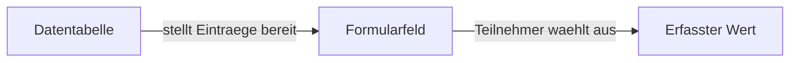

# Datentabellen (Custom Tables)

Datentabellen sind projektweite Nachschlagewerke, die Sie selbst anlegen und pflegen. Sie enthalten Stamm- und Referenzdaten, auf die Ihre Formulare zurueckgreifen koennen -- aehnlich wie eine Excelliste, die im Hintergrund bereitsteht.

## Wofuer eignen sich Datentabellen?

Ein paar Beispiele aus der Praxis:

Bei einem **Baustellen-Projekt** fuehren Sie eine Tabelle mit allen beteiligten Firmen. Jede Zeile enthaelt den Firmennamen, den Ansprechpartner und dessen Telefonnummer. Im Formular waehlt der Bauleiter dann einfach die zustaendige Firma aus dieser Liste aus -- die Kontaktdaten sind sofort verfuegbar.

Bei einer **Sicherheitsbegehung** pflegen Sie einen Massnahmenkatalog als Datentabelle. Wenn der Pruefer eine Gefaehrdung feststellt, kann er die passende Massnahme direkt aus dem Katalog auswaehlen, statt sie jedes Mal von Hand einzutippen.

Auch einfache **Auswahllisten** lassen sich als Datentabelle abbilden -- zum Beispiel Statuswerte, Materialkategorien oder Feuerloescher-Typen. Der Vorteil gegenueber einer fest eingebauten Auswahlliste im Formular: Sie koennen die Eintraege jederzeit zentral aendern, ohne das Formular selbst anfassen zu muessen.

## Aufbau

Eine Datentabelle besteht aus einem Namen, einer Hauptspalte und weiteren Spalten. Jede Tabelle hat einen internen Namen (fuer die Verwaltung) und einen Anzeigenamen, der in Formularen als Auswahlquelle erscheint. Die Hauptspalte bestimmt, welcher Wert angezeigt wird, wenn Teilnehmer einen Eintrag im Formular auswaehlen. Als Spaltentypen stehen Text, Zahl, Datum und Ja/Nein zur Verfuegung. Sie verwalten alles in Ueberblick Sector unter dem jeweiligen Projekt.

## Wie kommen Datentabellen ins Formular?

Im Formular-Editor fuegen Sie ein Feld vom Typ "Datenauswahl" hinzu und waehlen die gewuenschte Datentabelle als Quelle. Der Teilnehmer sieht dann vor Ort eine Auswahlliste mit den Eintraegen Ihrer Tabelle.

## Gut zu wissen

Aenderungen an einer Datentabelle wirken sich sofort aus. Wenn Sie einen neuen Eintrag hinzufuegen oder einen bestehenden aendern, sehen die Teilnehmer beim naechsten Oeffnen des Formulars die aktualisierte Liste. Das bedeutet aber auch: Loeschen Sie einen Eintrag, ist er in kuenftigen Formularen nicht mehr verfuegbar. Bereits erfasste Daten bleiben davon unberuehrt.

Sie koennen festlegen, welche Rollen auf eine Datentabelle zugreifen duerfen. Teilnehmer ohne die passende Rolle sehen die Eintraege weder in Formularen noch anderswo. So stellen Sie sicher, dass jedes Team nur die Daten sieht, die es fuer seine Arbeit braucht.

---

**Siehe auch:**
- [Formulare](formulare.md) -- Feldtypen und Datenauswahl
- [Projekte](projekte.md) -- Custom Tables als Projektbestandteil
- Tutorial: [Formulare und Tools](../tutorials/03-formulare-und-tools.md)
