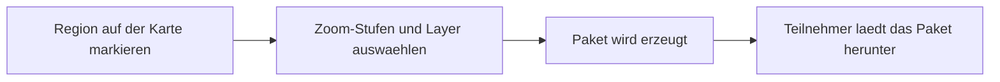

# Karten

Jedes Projekt in Ueberblick basiert auf einer Karte. Auf dieser Karte arbeiten Ihre Teilnehmer: Sie setzen Marker, fuellen Formulare aus und dokumentieren Zustaende vor Ort. Als Projektleiter legen Sie fest, welche Kartenhintergruende angezeigt werden und wie die Marker aussehen sollen.

## Kartenhintergruende (Layer)

Ein Layer ist eine Kartenschicht, die als Hintergrund dient. Sie koennen mehrere Layer uebereinander legen -- zum Beispiel eine Strassenkarte als Basis und Luftbilder als zusaetzliche Option.

Es gibt fuenf Arten von Kartenhintergruenden:

**Vordefinierte Karten** sind sofort einsatzbereit. Ueberblick bringt gaengige Kartenanbieter mit, darunter OpenStreetMap (Strassenkarte), CartoDB (helle oder dunkle Hintergruende fuer uebersichtliche Darstellung) und ESRI-Satellitenbilder. Fuer Projekte in Nordrhein-Westfalen stehen ausserdem amtliche Luftbilder und topographische Karten der Geobasis NRW zur Verfuegung.

**Eigene Tile-Server** koennen eingebunden werden, wenn Ihre Organisation einen internen Kartenserver betreibt. Dazu geben Sie die URL-Vorlage des Servers an.

**WMS-Dienste** (Web Map Services) ermoeglichen den Zugriff auf Karten von Behoerden und oeffentlichen Stellen -- etwa Katasterdaten oder Umweltkarten.

**Hochgeladene Karten** sind besonders nuetzlich, wenn Sie eigenes Kartenmaterial verwenden moechten. Sie laden ein ZIP-Archiv mit vorgeschnittenen Kartenkacheln hoch -- zum Beispiel aus Drohnenaufnahmen oder Gebaeudeplaenen, die Sie zuvor mit einem GIS-Werkzeug in Kacheln umgewandelt haben. Das ist ideal fuer Innenraeume wie Buerogebaeude oder Tiefgaragen, in denen normale Karten nicht weiterhelfen.

**GeoJSON-Dateien** eignen sich, um Gebietsgrenzen, Routen oder andere geometrische Daten als eigene Schicht auf der Karte darzustellen.

### Layer einrichten

Jeder Layer braucht einen Namen und einen Typ. Der Name erscheint im Layer-Umschalter, mit dem Teilnehmer zwischen verschiedenen Kartenhintergruenden wechseln koennen. Jeder Layer hat einen Aktiv-Schalter. Nur aktive Layer stehen den Teilnehmern zur Verfuegung -- so koennen Sie Layer vorbereiten, ohne dass sie sofort sichtbar werden.

Mindestens ein Layer muss als Hintergrundkarte eingerichtet sein, damit die Karte funktioniert. Diese Hintergrundkarte wird standardmaessig angezeigt. Sie koennen die Reihenfolge der Layer im Umschalter festlegen und bei Bedarf die Transparenz anpassen.

In den Karten-Einstellungen legen Sie ausserdem fest, welcher Kartenausschnitt und welche Zoomstufe beim Oeffnen der App angezeigt werden. So landet Ihr Team direkt im relevanten Gebiet, ohne erst manuell navigieren zu muessen.

## Marker-Kategorien

Marker-Kategorien bestimmen, wie die Punkte auf der Karte aussehen. Wenn Sie beispielsweise ein Projekt zur Gebaeudeverwaltung einrichten, koennten Sie Kategorien wie "Mangel", "Pruefpunkt" und "Erledigt" anlegen -- jede mit einer eigenen Farbe und Form.

Fuer jede Kategorie koennen Sie festlegen:

- **Name**: Erscheint in der Legende und bei der Marker-Auswahl.
- **Form und Farbe**: Waehlen Sie aus verschiedenen Formen (Kreis, Quadrat, Raute, Stern und weitere) und legen Sie Hintergrund- und Symbolfarbe fest. So erkennen Ihre Teilnehmer auf einen Blick, was ein Marker bedeutet.
- **Sichtbarkeit nach Rolle**: Bestimmte Kategorien koennen nur fuer bestimmte Rollen sichtbar sein. So sieht ein Brandschutzbeauftragter andere Marker als ein Reinigungsteam.
- **Eigene Felder**: Sie koennen jeder Kategorie zusaetzliche Eingabefelder zuweisen, die beim Setzen eines Markers ausgefuellt werden.

## Offline-Kartenpakete

Damit Teilnehmer auch ohne Internetverbindung mit der Karte arbeiten koennen -- etwa Waldarbeiter in Gebieten ohne Mobilfunkempfang oder bei Begehungen in Tiefgaragen -- stellen Sie Offline-Kartenpakete bereit.

Zeichnen Sie im Admin-Bereich den Kartenausschnitt ein, den Ihre Teilnehmer offline benoetigen. Waehlen Sie die gewuenschten Zoom-Stufen und Layer aus. Ueberblick erzeugt daraus ein Paket, das die Teilnehmer auf ihr Geraet herunterladen. Danach steht ihnen die Karte in diesem Bereich vollstaendig zur Verfuegung -- auch ohne Netzverbindung.

Sie koennen festlegen, welche Rollen ein bestimmtes Paket herunterladen duerfen. So erhaelt z.B. nur das Forstteam die Waldkarten, waehrend das Baustellen-Team seine eigenen Pakete bekommt. Auf diese Weise vermeiden Sie, dass Teilnehmer unnoetig grosse Datenmengen herunterladen.

---

**Siehe auch:**
- [Offline & Sync](offline-und-sync.md) -- Wie die Synchronisation funktioniert
- [Projekte](projekte.md) -- Karten-Layer als Projektbestandteil
- Tutorial: [Projekt einrichten](../tutorials/01-projekt-einrichten.md)
