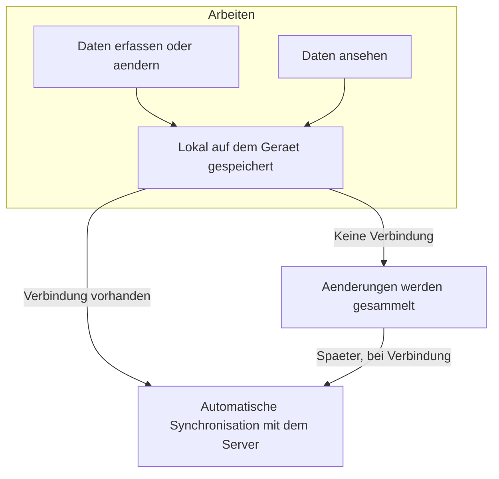

# Offline & Sync

Ueberblick ist so gebaut, dass die Teilnehmer-App auch ohne Internetverbindung vollstaendig funktioniert. Alle Daten -- erfasste Marker, ausgefuellte Formulare, Fotos und Kartenmaterial -- werden auf dem Geraet gespeichert. Sobald wieder eine Verbindung besteht, synchronisiert die App alles automatisch im Hintergrund mit dem Server. Fuer Ihre Teilnehmer macht es im Arbeitsalltag keinen Unterschied, ob sie gerade online oder offline sind.

## Offline vorbereiten

Bevor ein Teilnehmer ins Feld geht, sollte er bei bestehender Internetverbindung drei Dinge erledigen. Alle Einstellungen finden sich unter **Einstellungen > Offline & Daten** (erreichbar ueber das Zahnrad-Symbol auf der Karte).

### App installieren

Ueberblick laesst sich als App auf dem Startbildschirm installieren. Das bringt zwei Vorteile: Die App startet schneller und funktioniert zuverlaessiger offline, weil alle Oberflaechen-Dateien lokal vorgehalten werden.

Im Abschnitt **Als App installieren** sehen Teilnehmer den aktuellen Status. Steht dort "Im Browser geoeffnet", genuegt ein Klick auf **Installieren**, um die App hinzuzufuegen. Danach zeigt der Abschnitt "App installiert" an.

Nicht alle Browser unterstuetzen die Installation gleich gut. Chrome und Edge auf Android funktionieren am zuverlaessigsten. Safari auf iOS unterstuetzt PWA-Installation, hat aber Einschraenkungen beim Hintergrundspeicher -- im Zweifelsfall die App regelmaessig oeffnen, damit iOS den lokalen Speicher nicht bereinigt. Firefox unterstuetzt derzeit keine PWA-Installation.

### Karten-Tiles herunterladen

Ohne heruntergeladene Karten-Tiles sieht der Teilnehmer offline nur einen leeren Kartenhintergrund. Als Projektleiter stellen Sie Offline-Pakete bereit (siehe [Karten](karten_reviewed.md) > Offline-Tile-Pakete). Ihre Teilnehmer laden diese dann auf ihr Geraet:

1. Im Abschnitt **Karten-Tiles** auf **Tiles herunterladen** tippen.
2. Die Paketauswahl zeigt alle verfuegbaren Gebiete mit Zoom-Stufen, Tile-Anzahl und Dateigroesse.
3. Das gewuenschte Paket auswaehlen und auf **Download** tippen.
4. Die App laedt das Paket herunter und entpackt die Tiles -- ein Fortschrittsbalken zeigt den Stand. Anschliessend werden auch die zugehoerigen Projektdaten (Marker, Workflows usw.) synchronisiert.

Waehrend des Downloads erscheint eine Fortschrittsanzeige am unteren Bildschirmrand, auch wenn die Einstellungen geschlossen werden.

Nach dem Download zeigt der Abschnitt den Paketnamen, das Download-Datum, die Tile-Anzahl und die Groesse an. Ueber **Gebiet aendern** kann ein anderes Paket gewaehlt werden. Ueber **Loeschen** (mit anschliessender Bestaetigung) werden die lokalen Tiles entfernt, um Speicherplatz freizugeben.

Wenn ein Teilnehmer das Paket bereits auf einem anderen Geraet heruntergeladen hat, kann er die ZIP-Datei ueber **Paket aus Datei importieren** direkt laden, ohne sie erneut vom Server zu holen.

### Offline-Bilder aktivieren

Standardmaessig werden Fotos nur bei bestehender Verbindung geladen. Ueber den Schalter **Offline-Bilder** kann der Thumbnail-Cache aktiviert werden. Die App laedt dann verkleinerte Vorschaubilder (ca. 800 Pixel breit) herunter und speichert sie lokal. So sind Fotos auch ohne Internet sichtbar -- allerdings nicht in Originalaufloesung, sondern als Vorschau.

## So funktioniert die Synchronisation

### Daten lesen

Wenn ein Teilnehmer Daten aufruft, werden diese sofort aus dem lokalen Speicher geladen -- das geht schnell und funktioniert immer. Ist eine Internetverbindung vorhanden, prueft die App im Hintergrund, ob es auf dem Server neuere Daten gibt, und aktualisiert die Anzeige bei Bedarf.

### Daten schreiben

Aenderungen werden immer zuerst lokal gespeichert. Der Teilnehmer sieht seine Eingabe sofort auf dem Bildschirm, ohne auf eine Serverantwort warten zu muessen. Im Hintergrund reiht die App die Aenderung in eine Warteschlange ein. Die App wartet nach einer Aenderung fuenf Sekunden, bevor sie die Synchronisation anstosst. So werden mehrere schnell aufeinanderfolgende Eingaben gebuendelt uebertragen. Sobald eine Verbindung besteht, werden alle gesammelten Aenderungen der Reihe nach an den Server uebertragen.

Das bedeutet konkret: Ein Baustellenpruefer kann in einer Tiefgarage ohne Empfang zwanzig Maengel erfassen, Fotos anhaengen und Formulare ausfuellen. Sobald er wieder ins Freie tritt und Empfang hat, synchronisiert die App alles automatisch.

## Verbindungsstatus und manuelles Synchronisieren

In **Einstellungen > Profil** sehen Teilnehmer jederzeit ihren aktuellen Verbindungsstatus -- gruen fuer "Online", orange fuer "Offline". Darunter zeigt ein Zaehler, wie viele Aenderungen noch auf die Uebertragung warten (z.B. "3 ungespeicherte Aenderungen warten auf Upload").

Ueber den Button **Jetzt synchronisieren** kann die Synchronisation manuell angestossen werden. Das ist nuetzlich, wenn ein Teilnehmer sicherstellen moechte, dass wirklich alle Daten uebertragen wurden, bevor er das Geraet abgibt oder den Einsatzort verlaesst. Dieser Button ist nur bei bestehender Verbindung verfuegbar.

## Konfliktbehandlung

In seltenen Faellen kann es vorkommen, dass zwei Personen denselben Datensatz gleichzeitig aendern, waehrend eine davon offline ist. In diesem Fall uebernimmt die App zunaechst automatisch die Server-Version. Die lokale Aenderung wird aber nicht verworfen, sondern als Konflikt gespeichert.

Beim naechsten Oeffnen des betroffenen Datensatzes erscheint ein Konflikt-Dialog. Dort sieht der Teilnehmer Feld fuer Feld, worin sich die lokale und die Server-Version unterscheiden. Pro Feld kann er entscheiden: Server-Version behalten oder die eigene Aenderung erneut anwenden. So geht keine Information verloren und der Teilnehmer behaelt die Kontrolle.

## Was alles offline verfuegbar ist

Die App speichert alle Daten, die Ihre Teilnehmer zum Arbeiten brauchen:

- **Kartenmaterial**: Ueber die Offline-Kartenpakete, die Sie als Projektleiter bereitstellen (siehe [Karten](karten_reviewed.md)). Fuer zuverlaessige Abdeckung im Feld ist ein Offline-Paket notwendig.
- **Erfasste Daten**: Alle Marker, Formulareintraege und Tabellendaten, die zum Projekt gehoeren.
- **Fotos und Dokumente**: Wenn der Offline-Bilder-Schalter aktiviert ist, werden Vorschaubilder lokal gespeichert. Auch offline aufgenommene Fotos werden lokal vorgehalten und beim naechsten Sync hochgeladen.
- **Aenderungsprotokoll**: Eine lokale Aufzeichnung aller Aktionen, damit nach der Synchronisation nichts fehlt.

Die Synchronisation uebertraegt nur die tatsaechlich geaenderten Datensaetze, nicht jedes Mal den gesamten Datenbestand. Das spart Datenvolumen und geht schnell.

---

**Siehe auch:**

- [Karten](karten_reviewed.md) -- Offline-Kartenpakete einrichten
- [Workflows](workflows_reviewed.md) -- Instanz-Lebenszyklus
