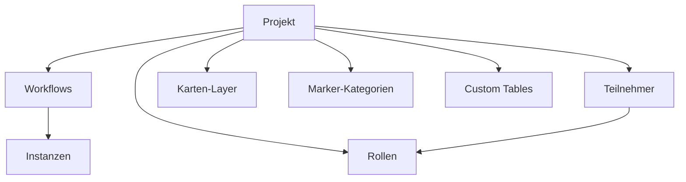

# Projekte

Ein Projekt ist die oberste Ebene in Ueberblick. Es buendelt alles, was zu einem bestimmten Einsatzzweck gehoert: die Workflows, die Karte, die Teilnehmer und deren Berechtigungen. Jedes Projekt ist in sich abgeschlossen -- Teilnehmer aus Projekt A sehen nichts von Projekt B.

Ein typisches Projekt koennte zum Beispiel "Sicherheitsbegehung Werk Sued" heissen, oder "Baumkontrolle Stadtwald 2026", oder schlicht "Gebaeudereinigung".

## Was gehoert zu einem Projekt?

Ein Projekt setzt sich aus mehreren Bausteinen zusammen, die Sie im Administrationsbereich (Ueberblick Sector) einzeln konfigurieren:

- **[Workflows](workflows_reviewed.md)** beschreiben, wie ein Vorgang ablaeuft -- von der Erfassung bis zum Abschluss. Ein Projekt kann mehrere Workflows enthalten, etwa einen fuer Maengelmeldungen und einen fuer Routinepruefungen.

- **[Rollen](rollen-und-teilnehmer_reviewed.md)** legen fest, wer was darf und was sieht. In einem Brandschutzprojekt koennten das zum Beispiel "Brandschutzbeauftragter", "Sicherheitsbeauftragter" und "Evakuierungshelfer" sein. Bei einer einfachen Reinigungsloesung reicht eine einzige Rolle fuer alle.

- **Teilnehmer** sind die Personen, die mit der App im Feld arbeiten. Jeder Teilnehmer gehoert zu genau einem Projekt und bekommt eine oder mehrere Rollen zugewiesen.

- **Karten-Layer** bestimmen, welche Hintergrundkarten und Overlays den Teilnehmern zur Verfuegung stehen -- zum Beispiel Luftbilder, Gebaeudeplaene oder Katasterkarten.

- **Marker-Kategorien** sorgen dafuer, dass Marker auf der Karte visuell unterscheidbar sind. Sie legen Icons und Farben fest, damit etwa Maengel anders aussehen als Pruefpunkte.

- **[Custom Tables](custom-tables_reviewed.md)** sind eigene Datentabellen, die Sie nach Bedarf anlegen koennen -- etwa fuer Geraete- oder Raumlisten, auf die Workflows Bezug nehmen.

## Projekt-Einstellungen

Wenn Sie ein neues Projekt anlegen, vergeben Sie einen **Namen** und optional eine **Beschreibung**. Der Name erscheint sowohl im Administrationsbereich als auch in der Teilnehmer-App.

Ueber den Schalter **Aktiv** steuern Sie, ob ein Projekt fuer Teilnehmer sichtbar ist. Solange ein Projekt inaktiv ist, koennen Sie in Ruhe konfigurieren, ohne dass Teilnehmer bereits darauf zugreifen.

## Gut zu wissen

- Jeder Teilnehmer gehoert zu genau einem Projekt. Wenn dieselbe Person in zwei Projekten arbeiten soll, legen Sie zwei Teilnehmer-Accounts an.
- Workflows, Rollen, Marker-Kategorien und Custom Tables sind immer an ein bestimmtes Projekt gebunden. Sie koennen diese Bausteine nicht projektuebgreifend teilen.
- Administratoren arbeiten im Ueberblick Sector und koennen alle Projekte verwalten -- unabhaengig von den Rollen innerhalb eines Projekts.

---

**Siehe auch:**
- [Rollen & Teilnehmer](rollen-und-teilnehmer_reviewed.md) -- Berechtigungsmodell
- [Workflows](workflows_reviewed.md) -- Datenerfassung konfigurieren
- Tutorial: [Projekt einrichten](../tutorials/01-projekt-einrichten_reviewed.md)
