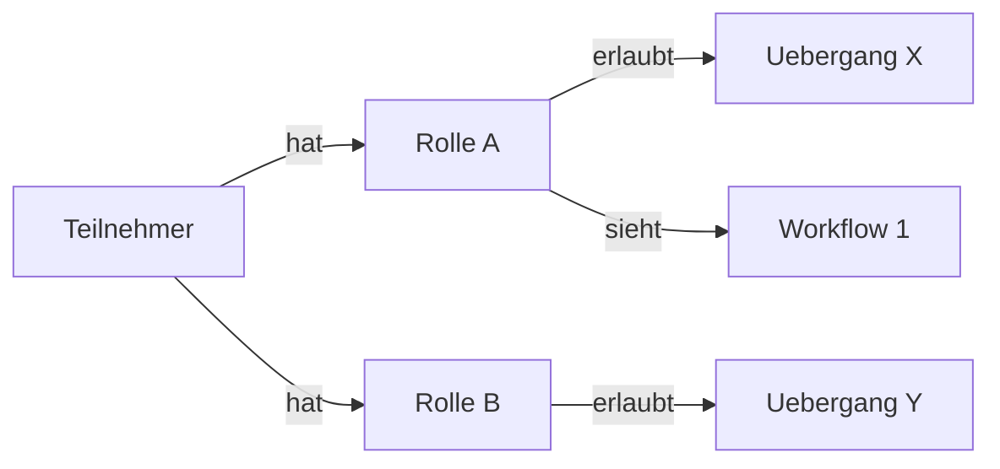

# Rollen & Teilnehmer

Rollen und Teilnehmer bilden zusammen das Berechtigungssystem innerhalb eines [Projekts](projekte_reviewed.md). Ueber Rollen steuern Sie, wer welche Workflows sieht, wer Vorgaenge anlegen darf und wer bestimmte Uebergaenge ausfuehren kann. Teilnehmer sind die konkreten Personen, denen Sie diese Rollen zuweisen.

## Administratoren und Teilnehmer

Ueberblick trennt zwei Bereiche strikt voneinander:

- **Administratoren** melden sich im Verwaltungsbereich (Ueberblick Sector) an. Sie konfigurieren Projekte, Workflows und Rollen, arbeiten aber nicht selbst in der Karten-App.

- **Teilnehmer** melden sich in der Ueberblick-App an und arbeiten im Feld. Ihre Berechtigungen ergeben sich ausschliesslich aus den zugewiesenen Rollen.

Administratoren und Teilnehmer verwenden unterschiedliche Zugaenge. Ein Administrator-Account gibt keinen Zugriff auf die Teilnehmer-App und umgekehrt.

## Rollen anlegen

Eine Rolle ist nichts weiter als ein Name -- etwa "Pruefingenieur", "Bauleiter" oder "Reinigungskraft". Rollen haben keine eigenen Einstellungen. Ihre Wirkung entfalten sie erst, wenn Sie sie an anderer Stelle einsetzen: bei Workflows, Verbindungen zwischen Stufen oder bei Tools.

Wie viele Rollen Sie brauchen, haengt vom Projekt ab. Einige Beispiele:

- **Reinigung:** Eine einzige Rolle genuegt ("Reinigungskraft"). Alle Teilnehmer sehen und tun dasselbe.
- **Sicherheitsbegehung:** Zwei Rollen -- der Sicherheitsbeauftragte fuehrt Begehungen durch, die Fachkraft fuer Arbeitssicherheit prueft und genehmigt die Ergebnisse.
- **Baustelle:** Drei oder mehr Rollen -- Objektueberwacher, Pruefingenieur und Bauleiter mit jeweils unterschiedlichen Befugnissen.
- **Brandschutz:** Abgestufte Rollen -- der Brandschutzbeauftragte darf alles, der Sicherheitsbeauftragte kann Meldungen erstellen, der Evakuierungshelfer darf nur mitlesen.

### Keine Rolle ausgewaehlt? Dann duerfen alle.

An vielen Stellen in Ueberblick koennen Sie festlegen, welche Rollen eine bestimmte Aktion ausfuehren oder einen bestimmten Bereich sehen duerfen. Wenn Sie dort keine Rolle auswaehlen, gilt die Einstellung fuer alle Teilnehmer -- unabhaengig von ihrer Rolle. Das betrifft unter anderem:

- Wer einen Workflow ueberhaupt sieht
- Wer neue Vorgaenge anlegen darf
- Wer einen bestimmten Uebergang zwischen Stufen ausfuehren darf
- Wer ein bestimmtes Tool verwenden darf

Auf der Rollen-Seite gibt es einen Tab "Berechtigungen", der Ihnen auf einen Blick zeigt, welche Rolle auf welche Workflows, Stufen, Tools und Datentabellen Zugriff hat. Dort koennen Sie Berechtigungen auch direkt per Klick ein- und ausschalten. Fuer die Hintergruende lesen Sie die Seite [Zugriffskontrolle](zugriffskontrolle_reviewed.md).

## Teilnehmer einrichten

Jeder Teilnehmer wird ueber folgende Angaben definiert:

- **Token:** Dient gleichzeitig als Benutzername und Passwort. Der Teilnehmer gibt dieses Token beim Login ein. Waehlen Sie etwas Merkbares, aber nicht Triviales.
- **Name:** Der Anzeigename, wie er in der App erscheint.
- **E-Mail und Telefon:** Optionale Kontaktdaten fuer Ihre interne Verwaltung.
- **Projekt:** Jeder Teilnehmer gehoert zu genau einem Projekt.
- **Rollen:** Weisen Sie eine oder mehrere Rollen zu. Ein Teilnehmer kann zum Beispiel gleichzeitig "Bauleiter" und "Sicherheitsbeauftragter" sein -- er erhaelt dann die Berechtigungen beider Rollen.
- **Aktiv:** Ueber diesen Schalter koennen Sie den Zugang eines Teilnehmers sperren, ohne ihn zu loeschen.
- **Ablaufdatum:** Optional. Nach diesem Datum kann sich der Teilnehmer nicht mehr einloggen. Dieses Feld wird derzeit ueber die Datenbank verwaltet und ist noch nicht in der Admin-Oberflaeche verfuegbar.

## Was passiert beim Login?

Wenn sich ein Teilnehmer in der App anmeldet, geschieht Folgendes:

Teilnehmer koennen sich auch per QR-Code anmelden. Dazu scannen sie den Code mit der Kamera oder laden ein Bild des Codes hoch. Der QR-Code enthaelt das Token und meldet den Teilnehmer automatisch an.

1. Das System prueft, ob der Teilnehmer aktiv ist und ob ein eventuelles Ablaufdatum nicht ueberschritten wurde.
2. Es werden nur die Workflows geladen, die fuer die Rollen des Teilnehmers freigegeben sind (oder fuer alle freigegeben wurden).
3. Bei jedem Vorgang sieht der Teilnehmer nur die Uebergaenge und Tools, die seinen Rollen entsprechen.

Ein Foerster im Forstprojekt sieht also alle Workflows und darf ueberall handeln, waehrend ein Waldarbeiter vielleicht nur den Workflow "Befallsmeldung" sieht und dort ausschliesslich neue Meldungen anlegen kann.

---

**Siehe auch:**
- [Projekte](projekte_reviewed.md) -- Projektstruktur
- [Workflows](workflows_reviewed.md) -- Wo Rollen an Verbindungen greifen
- [Zugriffskontrolle](zugriffskontrolle_reviewed.md) -- Detailregeln
- Tutorial: [Projekt einrichten](../tutorials/01-projekt-einrichten_reviewed.md)
