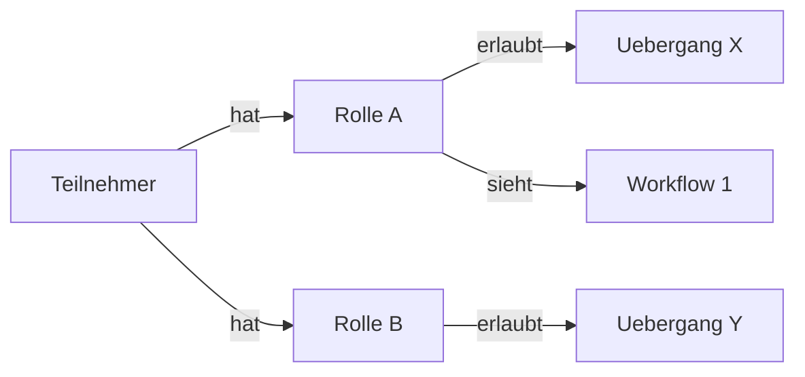

# Rollen & Teilnehmer

Rollen und Teilnehmer bilden zusammen das Berechtigungssystem innerhalb eines [Projekts](projekte.md). Ueber Rollen steuern Sie, wer welche Workflows sieht, wer Vorgaenge anlegen darf und wer bestimmte Uebergaenge ausfuehren kann. Teilnehmer sind die konkreten Personen, denen Sie diese Rollen zuweisen.

## Administratoren und Teilnehmer

Ueberblick trennt zwei Bereiche strikt voneinander:

- **Administratoren** melden sich im Verwaltungsbereich (Ueberblick Sector) an. Sie konfigurieren Projekte, Workflows und Rollen, arbeiten aber nicht selbst in der Karten-App.

- **Teilnehmer** melden sich in der Ueberblick-App an und arbeiten im Feld. Ihre Berechtigungen ergeben sich ausschliesslich aus den zugewiesenen Rollen.

Administratoren und Teilnehmer verwenden unterschiedliche Zugaenge. Ein Administrator-Account gibt keinen Zugriff auf die Teilnehmer-App und umgekehrt.

## Rollen anlegen

Eine Rolle traegt zunaechst nur einen Namen -- etwa "Pruefingenieur", "Bauleiter" oder "Reinigungskraft". Ihre eigentliche Wirkung entfaltet sie erst, wenn Sie sie an anderer Stelle einsetzen: bei Workflows, Verbindungen zwischen Stufen oder bei Tools. Daneben besitzt jede Rolle zwei eigene Einstellungen: den **Selbst-Beitritt** und ein **Limit fuer Eintraege pro Teilnehmer**. Beide erreichen Sie ueber die Rollen-Tabelle (Schalter "Selbst-Beitritt") bzw. ueber die Zeilenaktion "Beitritts-Link & Vorgaben" einer Rolle.

Wie viele Rollen Sie brauchen, haengt vom Projekt ab. Einige Beispiele:

- **Reinigung:** Eine einzige Rolle genuegt ("Reinigungskraft"). Alle Teilnehmer sehen und tun dasselbe.
- **Sicherheitsbegehung:** Zwei Rollen -- der Sicherheitsbeauftragte fuehrt Begehungen durch, die Fachkraft fuer Arbeitssicherheit prueft und genehmigt die Ergebnisse.
- **Baustelle:** Drei oder mehr Rollen -- Objektueberwacher, Pruefingenieur und Bauleiter mit jeweils unterschiedlichen Befugnissen.
- **Brandschutz:** Abgestufte Rollen -- der Brandschutzbeauftragte darf alles, der Sicherheitsbeauftragte kann Meldungen erstellen, der Evakuierungshelfer darf nur mitlesen.

### Keine Rolle ausgewaehlt? Dann duerfen alle.

An vielen Stellen in Ueberblick koennen Sie festlegen, welche Rollen eine bestimmte Aktion ausfuehren oder einen bestimmten Bereich sehen duerfen. Wenn Sie dort keine Rolle auswaehlen, gilt die Einstellung fuer alle Teilnehmer -- unabhaengig von ihrer Rolle. Das betrifft unter anderem:

- Wer einen Workflow ueberhaupt sieht
- Wer neue Vorgaenge anlegen darf
- Wer einen bestimmten Uebergang zwischen Stufen ausfuehren darf
- Wer ein bestimmtes Tool verwenden darf

Auf der Rollen-Seite gibt es einen Tab "Berechtigungen", der Ihnen auf einen Blick zeigt, welche Rolle auf welche Workflows, Stufen, Tools und Datentabellen Zugriff hat. Dort koennen Sie Berechtigungen auch direkt per Klick ein- und ausschalten. Fuer die Hintergruende lesen Sie die Seite [Zugriffskontrolle](zugriffskontrolle.md).

## Gast-Teilnehmer / Selbst-Beitritt

Normalerweise legen Sie jeden Teilnehmer von Hand an und geben ihm ein Token. Ueber den **Selbst-Beitritt** koennen sich Personen stattdessen selbst als Gast registrieren -- ohne dass Sie vorab ein Token ausgeben.

So richten Sie ihn ein:

1. Aktivieren Sie in der Rollen-Tabelle den Schalter **Selbst-Beitritt** der gewuenschten Rolle. Beim ersten Aktivieren erzeugt Ueberblick automatisch einen oeffentlichen Beitritts-Link der Form `/join/<slug>`.
2. Oeffnen Sie ueber die Zeilenaktion **Beitritts-Link & Vorgaben** den Dialog. Dort koennen Sie den Link kopieren und sehen, welche Vorgaben ein neuer Gast erhaelt.

Wer den Link aufruft, wird automatisch als Gast-Teilnehmer angelegt und sofort angemeldet. Ein Gast erhaelt dabei:

- den Namen **Guest**,
- genau die Rolle, zu der der Link gehoert,
- eine Platzhalter-E-Mail (`p-…@placeholder.local`),
- den Status **aktiv**,
- als Startseite die **Karte** (`/map`).

Gaeste werden nach **90 Tagen ohne Aktivitaet** automatisch deaktiviert (sie werden nicht geloescht, koennen sich danach aber nicht mehr anmelden).

Damit der Link nicht missbraucht werden kann, ist er durch eine Rate-Begrenzung pro IP-Adresse geschuetzt. Verlangt Ihre Instanz eine Einwilligung vor dem Login, wird auch beim Selbst-Beitritt zunaechst die Einwilligung abgefragt, bevor der Gast angelegt wird.

Gast-Teilnehmer tauchen in der Teilnehmerliste nur auf, wenn Sie dort den Schalter **Gaeste anzeigen** aktivieren -- so bleibt die Liste der regulaeren Teilnehmer uebersichtlich.

## Limit fuer Eintraege pro Teilnehmer

Im Dialog **Beitritts-Link & Vorgaben** (Zeilenaktion einer Rolle) koennen Sie ein **Limit fuer Eintraege pro Teilnehmer** festlegen. Es begrenzt, wie viele Workflow-Vorgaenge ein Teilnehmer mit dieser Rolle selbst anlegen darf.

- **0 oder leer** bedeutet **unbegrenzt**.
- Das Limit gilt **lebenslang** ueber die gesamte Teilnahme hinweg, nicht pro Tag oder pro Sitzung.
- **Geloeschte Eintraege zaehlen wieder frei:** Loescht ein Administrator einen Vorgang, sinkt der verbrauchte Zaehler entsprechend.
- Hat ein Teilnehmer **mehrere Rollen**, gewinnt die **grosszuegigste** Grenze ungleich null. Hat keine seiner Rollen ein positives Limit, ist er unbegrenzt.

Das Limit greift fuer alle Teilnehmer dieser Rolle -- nicht nur fuer Gaeste. Es eignet sich zum Beispiel, um bei einem oeffentlichen Meldeformular pro Person nur eine begrenzte Zahl an Meldungen zuzulassen.

## Teilnehmer einrichten

Jeder Teilnehmer wird ueber folgende Angaben definiert:

- **Token:** Dient gleichzeitig als Benutzername und Passwort. Der Teilnehmer gibt dieses Token beim Login ein. Waehlen Sie etwas Merkbares, aber nicht Triviales.
- **Name:** Der Anzeigename, wie er in der App erscheint.
- **E-Mail und Telefon:** Optionale Kontaktdaten fuer Ihre interne Verwaltung.
- **Projekt:** Jeder Teilnehmer gehoert zu genau einem Projekt.
- **Rollen:** Weisen Sie eine oder mehrere Rollen zu. Ein Teilnehmer kann zum Beispiel gleichzeitig "Bauleiter" und "Sicherheitsbeauftragter" sein -- er erhaelt dann die Berechtigungen beider Rollen.
- **Aktiv:** Ueber diesen Schalter koennen Sie den Zugang eines Teilnehmers sperren, ohne ihn zu loeschen.
- **Ablaufdatum:** Optional. Nach diesem Datum kann sich der Teilnehmer nicht mehr einloggen. Dieses Feld wird derzeit ueber die Datenbank verwaltet und ist noch nicht in der Admin-Oberflaeche verfuegbar.

## Was passiert beim Login?

Wenn sich ein Teilnehmer in der App anmeldet, geschieht Folgendes:

Teilnehmer koennen sich auch per QR-Code anmelden. Dazu scannen sie den Code mit der Kamera oder laden ein Bild des Codes hoch. Der QR-Code enthaelt das Token und meldet den Teilnehmer automatisch an.

Eine dritte Variante ist der **Selbst-Beitritt** (siehe oben): Wer einen Beitritts-Link `/join/<slug>` aufruft, braucht kein vorab ausgegebenes Token. Ueberblick legt im Hintergrund einen neuen Gast-Teilnehmer an und meldet ihn direkt an. Eine eventuell erforderliche Einwilligung wird auch hier zuvor abgefragt.

1. Das System prueft, ob der Teilnehmer aktiv ist und ob ein eventuelles Ablaufdatum nicht ueberschritten wurde.
2. Es werden nur die Workflows geladen, die fuer die Rollen des Teilnehmers freigegeben sind (oder fuer alle freigegeben wurden).
3. Bei jedem Vorgang sieht der Teilnehmer nur die Uebergaenge und Tools, die seinen Rollen entsprechen.

Ein Foerster im Forstprojekt sieht also alle Workflows und darf ueberall handeln, waehrend ein Waldarbeiter vielleicht nur den Workflow "Befallsmeldung" sieht und dort ausschliesslich neue Meldungen anlegen kann.

### Wie lange bleibt ein Teilnehmer angemeldet?

Eine Teilnehmer-Sitzung gilt **90 Tage**. Jedes Mal, wenn die App online geoeffnet wird, verlaengert sich diese Frist automatisch um weitere 90 Tage -- das geschieht im Hintergrund und ohne Zutun des Teilnehmers (auch beim manuellen "Jetzt synchronisieren"). Wer die App also auch nur gelegentlich, etwa einmal im Quartal, mit Verbindung oeffnet, bleibt dauerhaft angemeldet und muss sein Token nicht erneut eingeben.

Laeuft eine Sitzung dennoch ab -- weil die App ueber 90 Tage hinweg nie online war -- oder wird sie ungueltig, fuehrt der naechste Aufruf zurueck zur Anmeldeseite. Der Teilnehmer meldet sich dann einfach erneut mit seinem Token oder QR-Code an.

Diese Sitzungsdauer ist unabhaengig von der weiter oben beschriebenen Deaktivierung von Gast-Teilnehmern nach 90 Tagen ohne Aktivitaet: Erstere betrifft, wie lange ein Login auf dem Geraet gueltig bleibt, Letztere, ob ein Gast-Konto ueberhaupt noch existiert.

---

**Siehe auch:**
- [Projekte](projekte.md) -- Projektstruktur
- [Workflows](workflows.md) -- Wo Rollen an Verbindungen greifen
- [Zugriffskontrolle](zugriffskontrolle.md) -- Detailregeln
- Tutorial: [Projekt einrichten](../tutorials/01-projekt-einrichten.md)
