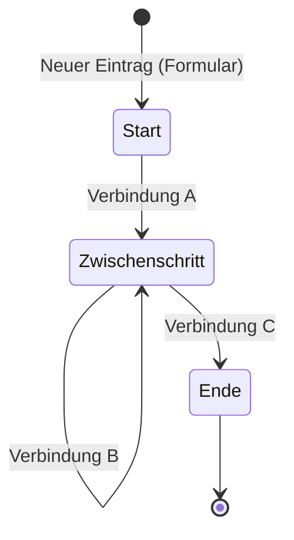

# Workflows

Ein Workflow bildet einen wiederkehrenden Ablauf in Ihrem [Projekt](projekte_reviewed.md) ab. Sie definieren, welche Schritte ein Vorgang durchlaeuft -- von der Erfassung bis zum Abschluss. Ueberblick fuehrt Ihre Teilnehmer dann durch genau diese Schritte.

Stellen Sie sich vor, Sie verwalten die Reinigung eines Gebaeudes: Jeder Raum beginnt im Zustand "Offen", wird von der Reinigungskraft als "Erledigt" markiert und kann bei Bedarf zurueckgesetzt werden. Oder denken Sie an eine Sicherheitsbegehung, bei der ein Mangel erfasst, bewertet, behoben und nachkontrolliert wird. Beides sind Workflows.

## Zwei Arten von Workflows

Ueberblick unterscheidet zwei Grundtypen:

**Kartenbasierte Workflows** eignen sich fuer alles, was einen Ort hat. Jeder Eintrag erscheint als Marker auf der Karte -- etwa Schadensmeldungen, Baumkontrollen oder Brandschutz-Kontrollpunkte entlang eines Fluchtwegs.

**Formular-Workflows** kommen ohne Kartenbezug aus. Sie eignen sich fuer Checklisten, Umfragen oder Pruefprotokolle, bei denen der Standort keine Rolle spielt.

## Die Bausteine eines Workflows

Ein Workflow besteht aus wenigen Grundelementen, die Sie im Workflow-Builder zusammensetzen:

**Stufen** sind die Zustaende, die ein Vorgang annehmen kann. Eine Reinigungsaufgabe koennte die Stufen "Offen", "In Arbeit" und "Erledigt" haben. Eine Sicherheitsbegehung vielleicht fuenf Stufen von "Erfasst" bis "Nachkontrolle bestanden". Jeder Workflow hat mindestens eine Startstufe (dort landen neue Eintraege) und kann eine oder mehrere Endstufen haben (dort ist der Vorgang abgeschlossen).

**Verbindungen** sind die Uebergaenge zwischen Stufen. Sie erscheinen als Buttons, die der Teilnehmer druecken kann -- zum Beispiel "Als erledigt markieren" oder "Zur Pruefung weiterleiten". Sie koennen festlegen, welche Rollen eine bestimmte Verbindung nutzen duerfen, sodass etwa nur Pruefingenieure einen Mangel freigeben koennen.

Bei jeder Verbindung koennen Sie den Button-Text, die Button-Farbe und einen optionalen Bestaetigungsdialog festlegen. So sieht der Teilnehmer z.B. einen gruenen "Erledigt"-Button oder einen roten "Ablehnen"-Button mit Rueckfrage ("Sind Sie sicher?").

Verbindungen koennen auch von einer Stufe zu sich selbst fuehren (sogenannte Self-Loops). Das ermoeglicht Bearbeitungen ohne Stufenwechsel -- z.B. ein Bearbeitungs-Tool, das Felder aktualisiert, waehrend der Eintrag in derselben Stufe bleibt. In der Praxis wird das haeufig genutzt, um Teilnehmern eine Korrekturmoeglichkeit zu geben, ohne den Fortschritt im Workflow zu beeinflussen.

**[Tools](tools_reviewed.md)** sind Funktionsbausteine, die Sie an Verbindungen oder Stufen anhaengen. So koennen Sie z.B. beim Uebergang von "Erfasst" zu "Bewertet" ein Bewertungsformular einblenden oder bei einer Statusaenderung automatisch einen Wert setzen lassen.

**Eintraege** (auch Instanzen genannt) sind die konkreten Vorgaenge, die den Workflow durchlaufen -- also der einzelne Raum, der gereinigt wird, oder der einzelne Mangel, der bearbeitet wird.

## Wie ein Eintrag entsteht und sich bewegt

Ein Teilnehmer erstellt einen neuen Eintrag -- bei kartenbasierten Workflows durch Tippen auf die Karte, bei Formular-Workflows ueber einen Button. Dabei fuellt er ein [Formular](formulare_reviewed.md) aus, und der Eintrag landet in der Startstufe.

Technisch wird beim Erstellen automatisch eine unsichtbare Verbindung zur Startstufe erzeugt -- die sogenannte Entry-Verbindung. An dieser haengt das Anfangsformular. Im Builder ist sie nicht als Pfeil sichtbar, sondern wird ueber die Startstufe konfiguriert.

Ab jetzt sieht der Teilnehmer die verfuegbaren Verbindungen als Buttons. Welche Buttons erscheinen, haengt von der aktuellen Stufe und der Rolle des Teilnehmers ab. So koennen Sie z.B. bei einer Baustellen-Doppelbewertung festlegen, dass der OUe-Pruefer und der Pruefingenieur jeweils nur ihren eigenen Bewertungsbutton sehen.

Jede Verbindung kann [Tools](tools_reviewed.md) ausfuehren -- etwa ein weiteres Formular anzeigen oder Werte automatisch setzen. Erreicht der Eintrag eine Endstufe, ist der Vorgang abgeschlossen.

Neben der aktuellen Stufe hat jeder Eintrag einen Status: aktiv, abgeschlossen oder archiviert. Dieser Status ist unabhaengig von der Stufe -- ein Eintrag kann z.B. in der Stufe "Erledigt" stehen, aber erst durch eine Automatisierung den Status "abgeschlossen" erhalten. Automatisierungen koennen diesen Status aendern, etwa um abgeschlossene Eintraege nach einer bestimmten Zeit automatisch zu archivieren.

Verbindungen koennen auch zurueckfuehren: Bei einer Gebaeudeinspektion nach DIN 31051 laesst sich ein Raum von Zustandsklasse C wieder auf B hochstufen, wenn Massnahmen ergriffen wurden. Oder ein Brandschutz-Abschnitt kann von "Eingeschraenkt konform" zurueck auf "Konform" gesetzt werden.

## So koennen Sie sich Workflows vorstellen

Ein Workflow ist im Grunde wie eine Tabelle: Jeder Eintrag ist eine Zeile, die Formularfelder sind die Spalten, und die aktuelle Stufe ist der Status der Zeile. Der Unterschied zu einer einfachen Tabelle ist, dass der Workflow steuert, wer wann welche Aenderungen vornehmen darf.

## Aktive und inaktive Workflows

Nur aktive Workflows sind fuer Teilnehmer sichtbar. Inaktive Workflows tauchen weder in der Auswahl noch auf der Karte auf. So koennen Sie einen Workflow in Ruhe vorbereiten oder nach Abschluss einer Saison deaktivieren, ohne ihn loeschen zu muessen.

## Dateien und Sichtbarkeit

An jeden Eintrag koennen Dateien angehaengt werden (bis zu 99 Stueck, jeweils maximal 10 MB). Das ist praktisch, wenn Teilnehmer bei einer Schadensmeldung Fotos hochladen oder bei einer Begehung Dokumente beifuegen sollen.

Wenn Sie moechten, dass Teilnehmer nur ihre eigenen Eintraege sehen, koennen Sie die private Sichtbarkeit aktivieren. Das ist z.B. bei einer blinden Doppelbewertung sinnvoll, bei der zwei Pruefer unabhaengig voneinander arbeiten sollen.

---

**Siehe auch:**
- [Tools](tools_reviewed.md) -- Funktionsbausteine fuer Formulare, Bearbeitungen und Automatisierungen
- [Formulare](formulare_reviewed.md) -- Feldtypen und Validierung
- [Rollen & Teilnehmer](rollen-und-teilnehmer_reviewed.md) -- Rollenbasierte Sichtbarkeit
- Tutorial: [Erster Workflow](../tutorials/02-erster-workflow_reviewed.md)
