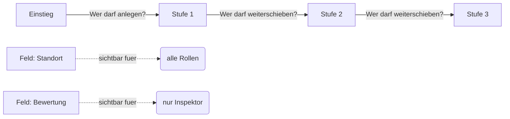

# Zugriffskontrolle

Die Zugriffskontrolle in Ueberblick bestimmt, welche Teilnehmer welche Vorgaenge sehen und welche Aktionen sie ausfuehren duerfen. Das System arbeitet in vier Schichten, die aufeinander aufbauen.

## Die vier Schichten

**Schicht 1 -- Projektmitgliedschaft.** Ein Teilnehmer sieht nur Daten aus seinem eigenen Projekt. Diese Trennung ist absolut -- es gibt keine Moeglichkeit, aus einem Projekt heraus auf ein anderes zuzugreifen.

**Schicht 2 -- Strukturelle Transparenz.** Jeder Teilnehmer, der einen Workflow sehen darf, erkennt dessen grundsaetzliche Struktur: die Namen der Stufen und den Fortschritt eines Vorgangs. Das sorgt fuer Orientierung, auch wenn der Teilnehmer nicht in jeder Stufe handeln darf.

**Schicht 3 -- Rollenbasierte Sichtbarkeit.** Hier greifen die Rollen. Sie koennen auf Workflow-Ebene festlegen, welche Rollen einen Workflow ueberhaupt sehen. Fuer jedes einzelne Feld laesst sich zusaetzlich bestimmen, welche Rollen seinen Wert einsehen duerfen. Und einzelne Tools koennen auf bestimmte Rollen beschraenkt werden. Wenn ein Workflow auf "privat" gestellt ist, sieht jeder Teilnehmer nur seine eigenen Vorgaenge.

**Schicht 4 -- Aktionsberechtigungen.** Die feinste Steuerung: Wer darf neue Vorgaenge anlegen? Wer darf einen bestimmten Uebergang ausfuehren? Diese Berechtigungen werden direkt am Workflow konfiguriert -- bei den Verbindungen zwischen Stufen und beim Einstiegspunkt.

## Grundregel: Keine Einschraenkung bedeutet Zugriff fuer alle

Wenn Sie an einer Stelle keine bestimmte Rolle auswaehlen, duerfen alle Teilnehmer diese Aktion ausfuehren oder diesen Bereich sehen. Es gibt keinen Sonderfall fuer den Ersteller eines Vorgangs -- die Rollenlogik gilt immer gleich.

Wenn Sie eine Aktion komplett sperren moechten, nutzen Sie folgenden Trick: Legen Sie eine Rolle an, der kein einziger Teilnehmer zugewiesen ist (z.B. "Gesperrt"), und waehlen Sie ausschliesslich diese Rolle aus. Da niemand die Rolle besitzt, kann auch niemand die Aktion ausfuehren.

## Berechtigungsuebersicht

Auf der Rollen-Seite in Ueberblick Sector finden Sie einen Tab "Berechtigungen". Dort sehen Sie auf einen Blick, welche Rolle auf welche Workflows, Felder, Tools, Datentabellen, Marker-Kategorien, Karten-Layer und Offline-Pakete Zugriff hat. Die Berechtigungen lassen sich dort auch direkt per Klick ein- und ausschalten, ohne jedes Element einzeln oeffnen zu muessen.

Das ist besonders hilfreich, wenn Sie nach dem Einrichten eines Workflows die Berechtigungen fuer alle Rollen ueberpruefen moechten -- oder wenn Sie eine neue Rolle anlegen und schnell sehen wollen, wo sie noch freigeschaltet werden muss.

## Wo Sie Berechtigungen konfigurieren

Neben der zentralen Berechtigungsuebersicht koennen Sie Rollen auch direkt an den einzelnen Elementen zuweisen. Es gibt vier zentrale Stellen:

**Am Workflow selbst** legen Sie fest, welche Rollen diesen Workflow ueberhaupt sehen. Zusaetzlich koennen Sie die private Sichtbarkeit aktivieren -- dann sieht jeder Teilnehmer nur die Vorgaenge, die er selbst erstellt hat. Das ist z.B. bei einer blinden Doppelbewertung auf der Baustelle sinnvoll, bei der zwei Pruefer unabhaengig voneinander arbeiten sollen.

**Beim Einstieg in den Workflow** legen Sie fest, welche Rollen neue Vorgaenge anlegen duerfen. In einem Forstprojekt koennten zum Beispiel sowohl Foerster als auch Waldarbeiter neue Befallsmeldungen erstellen -- aber nur der Foerster darf eine Einschlagsplanung starten.

**An jeder Verbindung zwischen zwei Stufen** bestimmen Sie, welche Rollen diesen Uebergang ausfuehren duerfen. In einer Sicherheitsbegehung darf der Sicherheitsbeauftragte den Vorgang von "Erfasst" nach "Zur Pruefung" schieben, waehrend nur die Fachkraft fuer Arbeitssicherheit den Uebergang von "Zur Pruefung" nach "Genehmigt" ausfuehren kann.

**An jedem einzelnen Feld** koennen Sie festlegen, welche Rollen seinen Wert einsehen duerfen. Diese Sichtbarkeit konfigurieren Sie in der Feld-Bibliothek des Workflow-Builders (in der Berechtigungsuebersicht erscheinen die Felder nach Daten-Reitern gruppiert). So koennten z.B. nur Pruefingenieure die detaillierten Bewertungsdaten sehen, waehrend andere Rollen zwar den Fortschritt des Vorgangs verfolgen, aber die betreffenden Werte nicht einsehen koennen.

## Wie die Feldsichtbarkeit in der Praxis wirkt

Stellen Sie sich einen Workflow mit drei Stufen vor: Eingereicht, Interne Pruefung und Loesung. Die in der Pruefung erfassten Felder -- etwa "Bewertungsnotizen" und "interne Einstufung" -- sind so konfiguriert, dass nur die Rolle "Inspektor" ihre Werte einsehen darf.

Was sieht ein Melder, der den Vorgang erstellt hat? Er sieht in der Zeitleiste, dass der Vorgang den Status "Aktuell bei: Interne Pruefung" traegt -- die strukturelle Transparenz (Schicht 2) bleibt erhalten. Die geschuetzten Felder (Bewertungsnotizen, interne Einstufung) bleiben ihm jedoch verborgen, alle uebrigen Felder sieht er normal. Die Sichtbarkeit haengt allein am jeweiligen Feld, nicht an der Stufe, in der der Wert erfasst wurde.

Wichtig: Der Schutz haengt am Feld und bleibt dauerhaft bestehen. Unabhaengig davon, in welcher Stufe sich der Vorgang gerade befindet, bleiben die Werte eines geschuetzten Feldes fuer nicht berechtigte Rollen verborgen.

## Beispiel: Sicherheitsbegehung

Ein Projekt mit drei Rollen -- Sicherheitsbeauftragter, Fachkraft fuer Arbeitssicherheit und Evakuierungshelfer:

| Aktion | Sicherheitsbeauftragter | Fachkraft fuer Arbeitssicherheit | Evakuierungshelfer |
|--------|------------------------|----------------------------------|---------------------|
| Neue Begehung anlegen | Ja | Nein | Nein |
| Weiterleiten zur Pruefung | Ja | Nein | Nein |
| Massnahme genehmigen | Nein | Ja | Nein |
| Abgeschlossene Vorgaenge sehen | Ja | Ja | Nein |

Der Evakuierungshelfer sieht in diesem Beispiel nur die Vorgaenge in bestimmten Stufen (etwa "Akute Gefahr"), darf aber selbst keine Uebergaenge ausfuehren.

## Beispiel: Reinigung

Bei einem einfachen Reinigungsprojekt mit nur einer Rolle brauchen Sie sich um Berechtigungen kaum Gedanken zu machen. Lassen Sie alle Rollenfelder leer -- dann darf jede Reinigungskraft alles sehen und jeden Uebergang ausfuehren.

## Stolperfallen

- **Aenderungen wirken sofort.** Wenn Sie die Sichtbarkeit eines Feldes aendern, gilt die neue Einstellung sofort fuer alle bestehenden Vorgaenge -- nicht nur fuer zukuenftige.
- **Kein Ersteller-Bonus.** Der Teilnehmer, der einen Vorgang angelegt hat, geniesst keine Sonderrechte. Er unterliegt denselben Rollenregeln wie alle anderen.
- **Bearbeitungs-Tools zeigen eine feste Feldauswahl.** Ein Bearbeitungs-Tool bietet genau die Felder zur Bearbeitung an, die Sie ihm ausdruecklich zugewiesen haben (berechnete Felder ausgenommen) -- unabhaengig davon, welche Stufen der Vorgang bereits durchlaufen hat.
- **Gaeste sehen einander nicht.** Per [Selbst-Beitritt](rollen-und-teilnehmer.md#gast-teilnehmer-selbst-beitritt) angelegte Gast-Teilnehmer koennen die uebrigen Teilnehmer nicht auflisten -- die Teilnehmer-Sichtbarkeit ist fuer Gaeste bewusst eingeschraenkt.

---

**Siehe auch:**
- [Rollen & Teilnehmer](rollen-und-teilnehmer.md) -- Rollendefinition und -zuweisung
- [Workflows](workflows.md) -- Stufen und Verbindungen
- [Tools](tools.md) -- Tool-Berechtigungen
