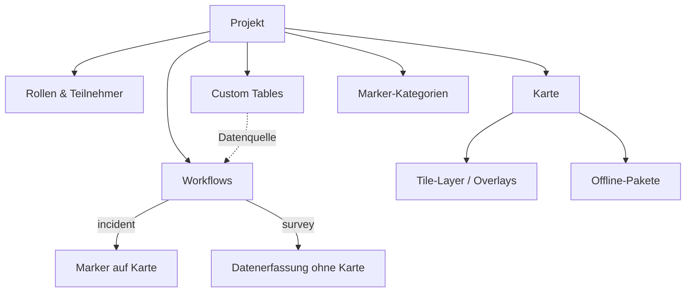

# Ueberblick Sector -- Administrationshandbuch

Dieser Guide gibt Ihnen einen Ueberblick ueber die Einrichtung und Konfiguration von Ueberblick. Die ausfuehrliche Dokumentation zu jedem Konzept finden Sie im [Handbuch](handbuch/).

---

## Inhaltsverzeichnis

1. [Was ist Ueberblick?](#was-ist-ueberblick)
2. [Navigation](#navigation)
3. [Konzepte im Ueberblick](#konzepte-im-ueberblick)
4. [Was sieht der Teilnehmer?](#was-sieht-der-teilnehmer)
5. [Walkthrough: Beispiel-Projekt](#walkthrough-beispiel-projekt)
6. [Haeufige Szenarien und Tipps](#haeufige-szenarien-und-tipps)

---

## Was ist Ueberblick?

Ueberblick ist eine Anwendung zur geografischen Datenerfassung mit Offline-Unterstuetzung. Zwei Oberflaechen:

- **Ueberblick Sector** -- Admin-Oberflaeche. Hier wird die App konfiguriert.
- **Ueberblick** -- Teilnehmer-App. Mobile-optimiert, offline-faehig, kartenbasiert.



Ein **Projekt** buendelt alle Bausteine. Alles gehoert zu einem Projekt -- es gibt keinen projektuebergreifenden Zugriff.

---

## Navigation

### Sector-Sidebar

```
Projekt-Sidebar
  > Workflows          Workflow-Liste, Builder, Einstellungen
  > Rollen             Rollen anlegen, Berechtigungsuebersicht
  > Teilnehmer         Teilnehmer anlegen, Rollen zuweisen
  > Karten-Einstell.   Layer, Offline-Pakete, Kartenstandards
  > Custom Tables      Statische Datentabellen
  > Marker-Kategorien  Visuelle Gruppierung von Markern
```

### Schnellreferenz

| Aktion | Ort |
|---|---|
| Projekt anlegen | Startseite > Neues Projekt |
| Rollen verwalten | Sidebar > Rollen |
| Berechtigungen pruefen | Sidebar > Rollen > Tab "Berechtigungen" |
| Teilnehmer anlegen | Sidebar > Teilnehmer |
| Workflow anlegen | Sidebar > Workflows > Neu |
| Workflow-Einstellungen | Workflows > Workflow anklicken |
| Builder oeffnen | Workflows > Workflow > Build |
| Stage hinzufuegen | Builder: aus linker Sidebar auf Canvas ziehen |
| Connection erstellen | Builder: Handle einer Stage zur Ziel-Stage ziehen |
| Formular hinzufuegen | Builder: Connection anklicken > Formular-Tool |
| Karten konfigurieren | Sidebar > Karten-Einstellungen |
| Custom Table anlegen | Sidebar > Custom Tables > Neu |

---

## Konzepte im Ueberblick

Die Konzepte sind im [Handbuch](handbuch/) ausfuehrlich beschrieben. Hier eine Kurzuebersicht mit Verweisen:

| Konzept | Kurzbeschreibung | Handbuch |
|---|---|---|
| **Projekt** | Container fuer alles. Jeder Teilnehmer gehoert zu genau einem Projekt. | [Projekte](handbuch/projekte_reviewed.md) |
| **Rollen** | Steuern Sichtbarkeit und Aktionsrechte. Leere Rollenliste = alle duerfen. | [Rollen & Teilnehmer](handbuch/rollen-und-teilnehmer_reviewed.md) |
| **Teilnehmer** | Login per Token (oder QR-Code). Eine oder mehrere Rollen. | [Rollen & Teilnehmer](handbuch/rollen-und-teilnehmer_reviewed.md) |
| **Workflows** | Stufen + Verbindungen + Tools. Typ "incident" (Karte) oder "survey" (ohne Karte). | [Workflows](handbuch/workflows_reviewed.md) |
| **Zugriffskontrolle** | Vier Schichten: Projekt, Transparenz, Rollensichtbarkeit, Aktionsrechte. | [Zugriffskontrolle](handbuch/zugriffskontrolle_reviewed.md) |
| **Tools** | Formular, Bearbeitung, Automatisierung, Feld-Tags. An Verbindung, Stufe oder global. | [Tools](handbuch/tools_reviewed.md) |
| **Formulare** | 10 Feldtypen inkl. Smart Dropdown und Datenauswahl. Mehrseitig, mehrspaltiges Layout. | [Formulare](handbuch/formulare_reviewed.md) |
| **Karten** | Layer (Preset, Tile, WMS, Upload, GeoJSON), Marker-Kategorien, Offline-Pakete. | [Karten](handbuch/karten_reviewed.md) |
| **Custom Tables** | Statische Datentabellen als Nachschlagewerk fuer Formulare. | [Custom Tables](handbuch/custom-tables_reviewed.md) |
| **Automatisierungen** | Trigger (Stufenwechsel, Feldaenderung, Zeitplan) + Bedingungen + Aktionen. | [Automatisierungen](handbuch/automatisierungen_reviewed.md) |
| **Offline & Sync** | Offline-first. Daten lokal, Sync im Hintergrund. Server gewinnt bei Konflikten. | [Offline & Sync](handbuch/offline-und-sync_reviewed.md) |

---

## Was sieht der Teilnehmer?

Zentrale Referenz: Was bewirkt jede Admin-Einstellung in der Teilnehmer-App?

### Workflow-Sichtbarkeit

| Admin-Einstellung | Teilnehmer sieht... |
|---|---|
| Workflow inaktiv | Workflow komplett unsichtbar. Keine Marker, kein Eintrag in der Auswahl. |
| Workflow aktiv | Workflow in der Auswahl, Marker auf Karte. |
| Einstiegsrollen leer | "+"-Button fuer alle Teilnehmer. |
| Einstiegsrollen gesetzt | "+"-Button nur fuer Teilnehmer mit passender Rolle. |
| Private Instanzen aktiv | Nur eigene Instanzen sichtbar. |

### Workflow-Typ

| Typ | Teilnehmer-Erlebnis |
|---|---|
| Kartenbasiert (incident) | Standortwahl auf Karte **vor** dem Formular. Instanz erscheint als Marker. |
| Formular (survey) | Formular oeffnet sich direkt. Kein Marker auf der Karte. |

### Stage-Sichtbarkeit

| Admin-Einstellung | Teilnehmer sieht... |
|---|---|
| Stage-Name | **Immer sichtbar** in Zeitleiste (strukturelle Transparenz). |
| Aktuelle Stage | **Immer sichtbar** -- Teilnehmer weiss, wo die Instanz steht. |
| Fortschritt | **Immer sichtbar** -- "Stage 2 von 4". |
| Stufensichtbarkeit leer | Formulardaten dieser Stage fuer alle sichtbar. |
| Stufensichtbarkeit gesetzt | Formulardaten nur fuer ausgewaehlte Rollen. Andere sehen Stage-Name, aber keine Daten. |

### Connection-Buttons

| Admin-Einstellung | Teilnehmer sieht... |
|---|---|
| Rollenfeld leer | Button fuer alle sichtbar. |
| Rollen gesetzt | Button nur fuer passende Rollen. Andere sehen keinen Button. |
| Button-Text gesetzt | Button mit dem konfigurierten Text (z.B. "Genehmigen"). |
| Button-Farbe gesetzt | Farbiger Button (z.B. gruen fuer Bestaetigungen, rot fuer Ablehnungen). |
| Bestaetigung aktiv | Bestaetigungsdialog vor Ausfuehrung. |

### Tool-Sichtbarkeit

| Szenario | Teilnehmer sieht... |
|---|---|
| Tool an Verbindung | Kein eigener Button. Tool laeuft beim Klick auf den Verbindungs-Button. |
| Tool an Stufe (Rollen leer) | Eigener Button auf dieser Stufe fuer alle. |
| Tool an Stufe (Rollen gesetzt) | Button nur fuer passende Rollen. |
| Globales Bearbeitungs-Tool | Button auf **jeder** Stufe. |
| Bearbeitung: Felder | Zeigt nur Felder aus bereits durchlaufenen Stufen. |
| Bearbeitung: Standort | Kartenansicht zum Verschieben des Markers. |

### Formular-Darstellung

| Admin-Einstellung | Teilnehmer sieht... |
|---|---|
| Pflichtfeld aktiv | Feld mit Pflichtfeld-Markierung, Absenden blockiert ohne Wert. |
| Platzhalter gesetzt | Grauer Hinweistext im leeren Feld. |
| Hilfetext gesetzt | Kleiner Text unter dem Feld. |
| Mehrseitiges Formular | Seiten-Navigation (Weiter/Zurueck). |
| Position links/rechts | Zwei Felder nebeneinander (Desktop). Auf Mobile: untereinander. |
| Datenauswahl | Dropdown mit Eintraegen der referenzierten Tabelle. |
| Abhaengige Auswahl | Optionen aendern sich basierend auf Wert eines anderen Feldes. |

### Karten-Darstellung

| Admin-Einstellung | Teilnehmer sieht... |
|---|---|
| Layer inaktiv | Layer nicht verfuegbar. |
| Layer aktiv | Layer im Layer-Switcher schaltbar. |
| Kein Hintergrund-Layer aktiv | Leere Karte (Fehler). |
| Kartenstandards (Zentrum/Zoom) | Karte oeffnet sich an dieser Position. |
| Offline-Paket vorhanden | Kartenbereich auch ohne Internet verfuegbar. |

### Automatisierungen aus Teilnehmersicht

Automatisierungen laufen unsichtbar im Hintergrund. Der Teilnehmer bemerkt nur die Auswirkungen:

| Automatisierung | Was der Teilnehmer sieht |
|---|---|
| Stufe setzen | Instanz springt in eine andere Stufe. |
| Feldwert setzen | Feldwert aendert sich (z.B. berechnetes Feld). |
| Status aendern | Status aendert sich (z.B. automatisch abgeschlossen). |
| Zeitgesteuert (Cron) | Aenderungen treten zum Zeitpunkt des naechsten Laufs ein. |

---

## Walkthrough: Beispiel-Projekt

Aufbau eines "Vorfall melden"-Projekts mit drei Rollen: Melder, Inspektor, Manager.

### 1. Projekt und Rollen

1. Neues Projekt: "Vorfall-Management"
2. Drei Rollen anlegen:

| Rolle | Aufgabe |
|---|---|
| Melder | Reicht Vorfaelle ein |
| Inspektor | Prueft und untersucht |
| Manager | Genehmigt oder lehnt ab |

3. Teilnehmer anlegen und Rollen zuweisen.

### 2. Karte konfigurieren

1. Karten-Einstellungen: Hintergrund-Layer auf OSM (Preset) setzen.
2. Optional: Kartenstandards setzen (Zentrum auf relevantes Gebiet).

### 3. Workflow erstellen

1. Neuer Workflow: "Vorfall melden", Typ: Kartenbasiert, Marker-Farbe waehlen.
2. Builder oeffnen.

### 4. Stufen anlegen

Aus linker Sidebar auf Canvas ziehen:

| Stufe | Typ | Stufensichtbarkeit |
|---|---|---|
| Eingereicht | Start | leer (alle) |
| In Pruefung | Intermediate | Inspektor, Manager |
| Geloest | End | leer (alle) |
| Abgelehnt | End | leer (alle) |

### 5. Verbindungen

| Von | Nach | Rollen | Button-Text |
|---|---|---|---|
| Entry | Eingereicht | Melder | -- |
| Eingereicht | In Pruefung | Manager | "Zur Pruefung" |
| In Pruefung | Geloest | Inspektor | "Geloest" |
| In Pruefung | Abgelehnt | Inspektor | "Ablehnen" |

### 6. Formulare

**Entry-Formular** (an der Entry-Verbindung):
- "Titel" (Kurztext, Pflichtfeld)
- "Beschreibung" (Langtext, Pflichtfeld)
- "Foto" (Datei-Upload, optional)
- "Schweregrad" (Auswahlliste: Niedrig, Mittel, Hoch)

**Pruefungs-Formular** (an der Verbindung Eingereicht -> In Pruefung):
- "Befunde" (Langtext)
- "Empfohlene Massnahme" (Auswahlliste: Reparatur, Austausch, Beobachten)

### 7. Bearbeitungs-Tool

Bearbeitungs-Tool auf Stufe "In Pruefung":
- Modus: Felder bearbeiten
- Bearbeitbare Felder: "Schweregrad" (aus dem Entry-Formular)
- Sichtbar fuer: Inspektor
- Button-Text: "Schweregrad aendern"

### 8. Speichern und aktivieren

Builder speichern, Workflow auf "Aktiv" setzen.

### Ergebnis: Berechtigungsmatrix

| Aktion | Melder | Inspektor | Manager |
|---|---|---|---|
| Instanz erstellen | Ja | -- | -- |
| Entry-Daten sehen | Ja | Ja | Ja |
| "Zur Pruefung" Button | -- | -- | Ja |
| Pruefungsdaten sehen | -- | Ja | Ja |
| "Geloest"/"Ablehnen" Button | -- | Ja | -- |
| Schweregrad aendern | -- | Ja | -- |
| Loesungsdaten sehen | Ja | Ja | Ja |

### Ergebnis aus Teilnehmersicht

- **Melder**: "+"-Button > "Vorfall melden" > Standort waehlen > Formular > Marker bei "Eingereicht". Sieht Zeitleiste, aber keine Pruefungsdaten.
- **Manager**: Instanz antippen > "Zur Pruefung"-Button > Pruefungsformular ausfuellen > Instanz wandert.
- **Inspektor**: Instanz bei "In Pruefung" > Pruefungsdaten sichtbar > "Schweregrad aendern"-Button > "Geloest"/"Ablehnen"-Buttons.
- **Melder**: Sieht "In Pruefung" in Zeitleiste, aber keine Daten. Nach Loesung: Loesungsdaten sichtbar.

---

## Haeufige Szenarien und Tipps

### Szenarien

**"Nur Manager duerfen genehmigen"** -- Rollen der Verbindung zur Genehmigungs-Stufe auf "Manager" setzen.

**"Interne Pruefungsdaten verbergen"** -- Stufensichtbarkeit der Pruefungs-Stufe auf die gewuenschten Rollen setzen. Andere sehen den Stufennamen, aber keine Daten.

**"Alle duerfen melden, nur Inspektoren pruefen"** -- Einstiegsrollen leer lassen (alle duerfen anlegen), Verbindung zur Pruefung nur fuer Inspektoren freigeben.

**"Feld nach Einreichung bearbeitbar"** -- Bearbeitungs-Tool auf der gewuenschten Stufe. Modus "Felder bearbeiten", Felder auswaehlen, Rollen festlegen.

**"Kartenstandort nachtraeglich aendern"** -- Bearbeitungs-Tool mit Modus "Standort" auf der gewuenschten Stufe.

**"Instanzen nach 7 Tagen automatisch abschliessen"** -- Zeitgesteuerte Automatisierung: taeglich, Inaktivitaet 7 Tage, Aktion: Status auf "abgeschlossen".

**"Summe aus Feldern berechnen"** -- Automatisierung mit Trigger "Bei Feldaenderung" auf das Mengen-Feld, Aktion: Feldwert setzen mit Ausdruck.

**"Kreislauf ohne Endpunkt"** -- Zwei Stufen: Offen (Start) und Erledigt (Intermediate, nicht End). Verbindungen in beide Richtungen. Zeitgesteuerte Automatisierung setzt Erledigt zurueck auf Offen.

### Stolperfallen

- **Entry-Verbindung nicht sichtbar** -- Entry-Verbindungen erscheinen nicht als Pfeil auf dem Canvas. Konfiguration ueber die Startstufe anklicken.
- **Stufensichtbarkeit geaendert -- wirkt sofort** -- Aenderungen gelten sofort fuer alle bestehenden Daten, nicht nur fuer zukuenftige.
- **Ersteller sieht eigene Daten nicht** -- Es gibt kein Ersteller-Privileg. Loesung: Rolle des Erstellers in der Stufensichtbarkeit aufnehmen.
- **Bearbeitungs-Tool zeigt keine Felder** -- Bearbeitungs-Tools zeigen nur Felder aus Stufen, die der Eintrag bereits durchlaufen hat.
- **Automatisierung loest nicht aus** -- Zeitgesteuert: Minimum 15 Minuten. Pruefen: Ist sie aktiviert? Stimmt die Ziel-Stufe? Stimmen die Bedingungen?

### Tipps

- **Iterativ arbeiten.** Zuerst alle Rollenfelder leer lassen (alles offen), Workflow verifizieren, dann schrittweise einschraenken.
- **Berechtigungsuebersicht nutzen.** Unter Rollen > Tab "Berechtigungen" sehen Sie auf einen Blick, welche Rolle was darf -- und koennen dort direkt toggeln.
- **Mit verschiedenen Rollen testen.** Test-Teilnehmer pro Rolle anlegen und durchspielen.
- **Stage Preview nutzen.** Im Builder eine Stufe anklicken -- zeigt die Teilnehmersicht mit Buttons und Tools.
- **Regelmaessig speichern.** Der Builder haelt Aenderungen im Speicher. Ungespeicherte Aenderungen gehen beim Schliessen verloren.
- **Self-Loops fuer Bearbeitungen.** Verbindung von einer Stufe zu sich selbst + Bearbeitungs-Tool = Bearbeitung ohne Stufenwechsel.

---

## Weiterfuehrende Dokumentation

| Dokument | Inhalt |
|---|---|
| [Handbuch](handbuch/) | Ausfuehrliche Referenz zu jedem Konzept |
| [Tutorials](tutorials/) | Schritt-fuer-Schritt Anleitungen |
| [Entwicklung](dev/) | Architektur, Setup, Konventionen, Erweiterbarkeit |
